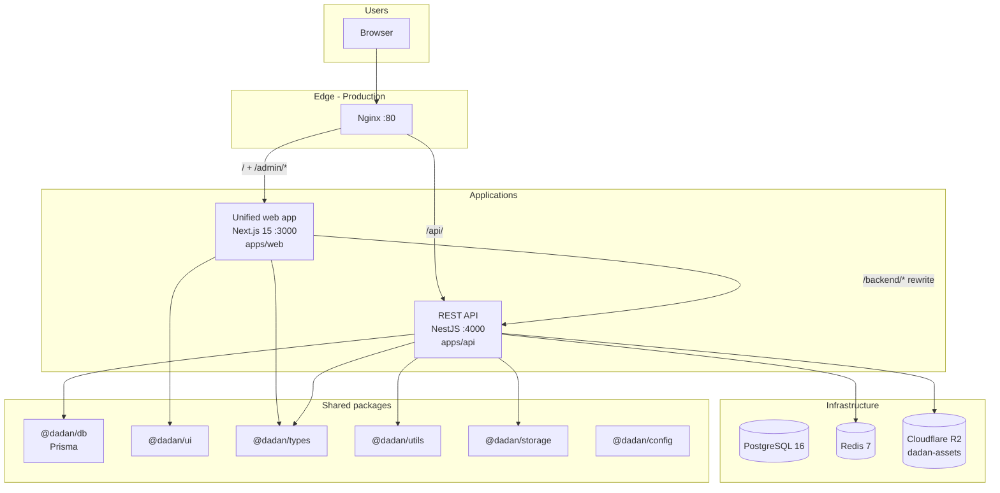

# DADAN Dijital — Architecture

> **Platform:** Closed, invitation-only luxury digital jewelry ownership house  
> **Stack:** Next.js 15 · NestJS · PostgreSQL · Prisma · Redis · Cloudflare R2  
> **Last updated:** July 2026

---

## Overview

**DADAN Dijital** is a closed, invitation-only luxury jewelry ownership platform. Clients enter with a **House Key** (not public signup), browse a **curated catalog**, purchase one-of-a-kind pieces, manage a digital **wardrobe** with certificates, and transfer ownership through a multi-party approval workflow.

### Related documents

| Document                                                               | Purpose                                          |
| ---------------------------------------------------------------------- | ------------------------------------------------ |
| [README.md](./README.md)                                               | Local setup and scripts                          |
| [DADAN_BUSINESS_LOGIC.md](./DADAN_BUSINESS_LOGIC.md)                   | Domain rules, state machines, security contracts |
| [packages/db/MODELS.md](./packages/db/MODELS.md)                       | Database relationship reference                  |
| [packages/db/prisma/schema.prisma](./packages/db/prisma/schema.prisma) | Schema source of truth                           |

---

## High-level system view



---

## Monorepo layout

Turborepo + pnpm workspaces orchestrate builds, dev, lint, test, and DB tasks.

```
apps/
  web/      Next.js 15 — client app + admin dashboard (/admin/*)
  api/      NestJS — REST API, business logic, auth

packages/
  db/       Prisma schema + generated client (shared)
  ui/       Shared React component library (luxury design tokens)
  types/    Shared TypeScript interfaces and enums
  utils/    Shared pure utilities (serial number, certificate, transfer logic)
  storage/  Cloudflare R2 upload, signed URLs, key conventions
  config/   Shared ESLint, Prettier, TypeScript base configs
```

| Layer          | Path               | Role                                                                   |
| -------------- | ------------------ | ---------------------------------------------------------------------- |
| **Web app**    | `apps/web`         | Client routes + admin at `/admin/*` in one Next.js app                 |
| **API**        | `apps/api`         | NestJS REST API — all business logic, auth, state machines             |
| **Database**   | `packages/db`      | Prisma schema, migrations, generated client                            |
| **UI library** | `packages/ui`      | Shared luxury components (`PrivateLayout`, `AdminLayout`, etc.)        |
| **Types**      | `packages/types`   | Shared TS interfaces (sessions, shipping, API shapes)                  |
| **Utils**      | `packages/utils`   | Pure domain helpers (serial numbers, visibility, transfer transitions) |
| **Storage**    | `packages/storage` | R2/S3 upload, signed URLs, key conventions                             |
| **Config**     | `packages/config`  | Shared ESLint + TypeScript configs                                     |

---

## Frontend architecture (unified `apps/web`)

```mermaid
flowchart TD
  GATE["/ — Access gate<br/>House Key form"]
  PRIVATE["/(private)/* — Client routes"]
  ADMIN["/admin/* — Staff dashboard"]

  GATE -->|validate-key| PRIVATE

  subgraph private_routes [Client routes]
    HOME[/home]
    COLL[/collections]
    PIECE[/pieces/:slug]
    CART[/cart]
    WARD[/wardrobe]
    ORD[/orders]
    TRANS[/transfers]
  end

  subgraph admin_routes [Admin routes]
    LOGIN[/admin/login]
    DASH[/admin/dashboard]
    OPS[/admin/clients · pieces · orders · transfers]
  end

  PRIVATE --> private_routes
  ADMIN --> LOGIN
  ADMIN --> DASH
  ADMIN --> OPS
```

- **Client auth:** `(private)/layout.tsx` calls `requireClientSession()`; middleware gates non-`/` client paths on `dadan_session`.
- **Admin auth:** `admin/(dashboard)/layout.tsx` calls `requireAdminSession()`; middleware allows `/admin/*` without client cookie.
- **Sessions:** Separate cookies (`dadan_session` vs `dadan_admin_session`) — never merged.
- **API access:** Browser hits `/backend/*` → Next.js rewrite → NestJS (`apps/web/next.config.ts`).
- **Theming:** Client uses RTL Arabic dark theme; admin uses `data-theme="admin"` LTR shell.

---

## Storage (Cloudflare R2)

- **No self-hosted MinIO** — all environments use Cloudflare R2 (S3-compatible API).
- **Free tier:** 10 GB storage, 1M writes, 10M reads/month, zero egress fees.
- **Private bucket** — assets served via presigned URLs generated at read time.
- DB stores **object keys only**; API resolves keys to signed URLs in read responses.

| Field                      | Example key                            |
| -------------------------- | -------------------------------------- |
| `Certificate.pdfUrl`       | `certificates/{certificateId}.pdf`     |
| `Design.imageUrls[]`       | `designs/{designId}/{uuid}.jpg`        |
| `Collection.coverImageUrl` | `collections/{collectionId}/cover.jpg` |

Env vars: `S3_ENDPOINT`, `S3_BUCKET`, `S3_ACCESS_KEY`, `S3_SECRET_KEY`, `S3_REGION=auto`.

---

## Infrastructure

### Local dev (`docker-compose.yml`)

| Service    | Port | Purpose                 |
| ---------- | ---- | ----------------------- |
| PostgreSQL | 5433 | Primary database        |
| Redis      | 6379 | Rate limiting, sessions |

Apps run via `pnpm dev` (Turbo). R2 credentials required in `.env`.

| Service              | URL                               |
| -------------------- | --------------------------------- |
| Web (client + admin) | http://localhost:3000             |
| Admin login          | http://localhost:3000/admin/login |
| API                  | http://localhost:4000             |

### Production (`docker-compose.prod.yml`)

Containerized: **postgres, redis, api, web, nginx**. R2 is external (no storage container).

| Path    | Target                    |
| ------- | ------------------------- |
| `/`     | web (client + `/admin/*`) |
| `/api/` | api (rate-limited)        |

---

## Security model

| Concern           | Implementation                                                      |
| ----------------- | ------------------------------------------------------------------- |
| Client auth       | House Key (bcrypt) + JWT in httpOnly cookie                         |
| Admin auth        | Email/password + separate JWT                                       |
| Session isolation | Client and admin tokens never cross                                 |
| Rate limiting     | Redis-backed on auth; nginx rate limits in prod                     |
| Visibility        | Group-based curation — clients only see allowed collections/designs |
| Audit             | Immutable `AuditLog` for significant mutations                      |
| CORS              | API allows `WEB_ORIGIN` / `BASE_URL` with credentials               |

---

## Dependency graph

```
apps/web ──┬── @dadan/ui
           ├── @dadan/types
           └── (rewrites to) apps/api

apps/api ──┬── @dadan/db (Prisma)
           ├── @dadan/types
           ├── @dadan/utils
           ├── @dadan/storage
           ├── PostgreSQL
           ├── Redis
           └── Cloudflare R2
```
