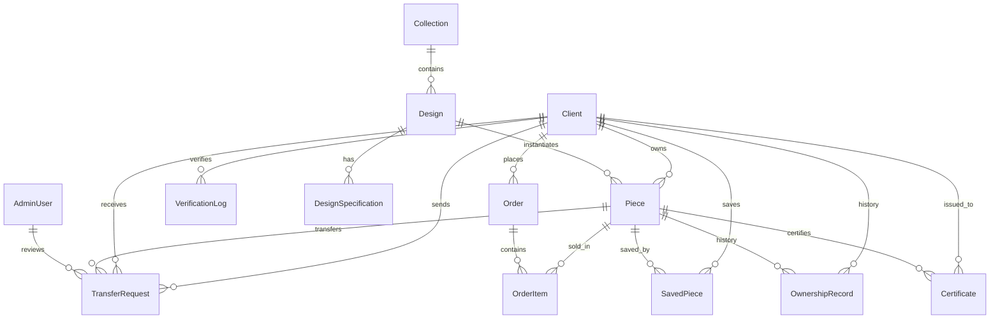
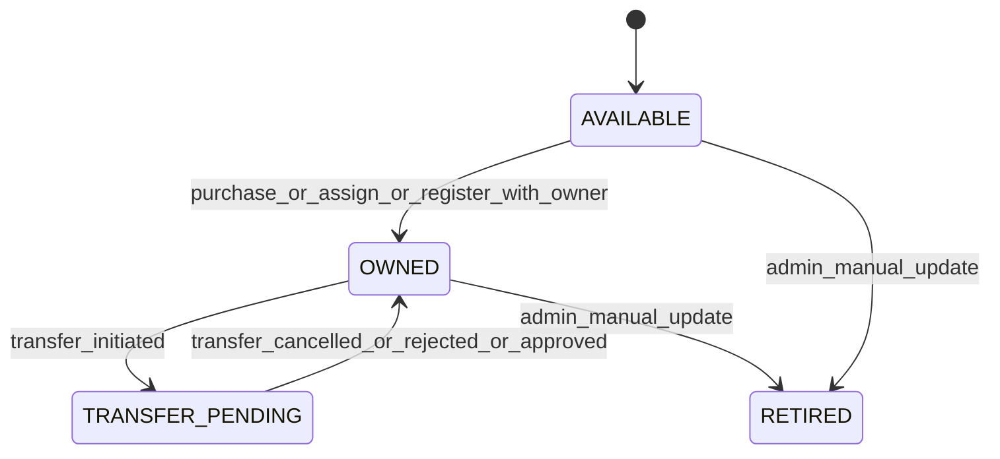
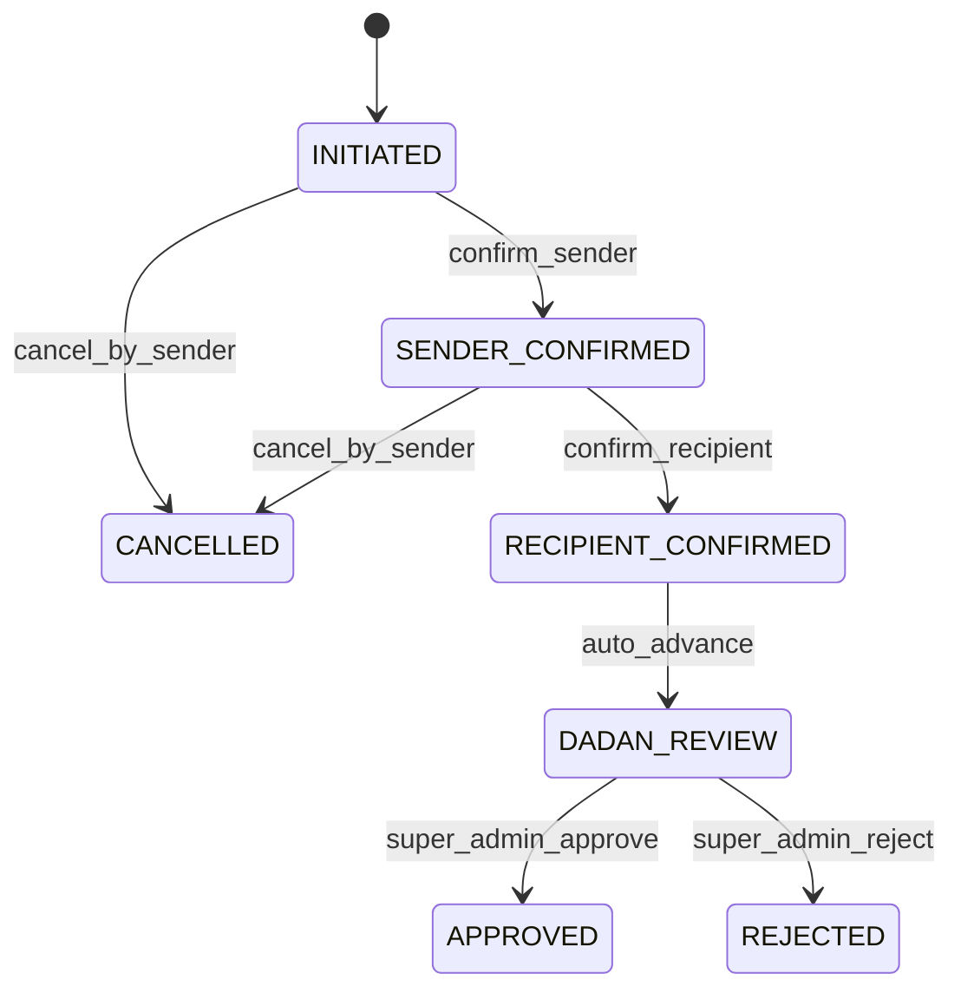

# DADAN Dijital — Business Logic Reference

> **Platform:** Closed, invitation-only luxury digital jewelry ownership house  
> **Audience:** Product, engineering, and operations — domain rules, state machines, and security contracts  
> **Last aligned with:** Prisma schema, NestJS API (`apps/api/src`), shared utils (`packages/utils`)

## Related documents

| Document                                                                                                                         | Purpose                                      |
| -------------------------------------------------------------------------------------------------------------------------------- | -------------------------------------------- |
| [DADAN_DIJITAL_PROMPT_GUIDE.md](./DADAN_DIJITAL_PROMPT_GUIDE.md)                                                                 | Implementation prompts (00–14)               |
| [packages/db/prisma/schema.prisma](./packages/db/prisma/schema.prisma)                                                           | Database schema source of truth              |
| [packages/db/README.md](./packages/db/README.md)                                                                                 | Seed data and dev credentials                |
| [packages/storage/src/interfaces/storage-provider.interface.ts](./packages/storage/src/interfaces/storage-provider.interface.ts) | Storage provider contract (Strategy Pattern) |

This document describes **what the platform does and which rules are non-negotiable**. It does not cover Docker setup, CI, or UI component specs.

---

## 1. Platform overview

### 1.1 Product model

DADAN Dijital is a **private luxury jewelry ownership platform**. Clients do not browse a public catalog — they enter with a **House Key** issued by DADAN and see a **curated experience** based on visibility groups. Each physical jewelry piece has a **unique serial number**, a **digital certificate of authenticity**, and an **append-only ownership history**.

Core capabilities:

- **Curated catalog** — collections and designs filtered per client
- **Direct purchase** — one-of-a-kind pieces; each serial sold once
- **Jewelry wardrobe** — owned pieces, certificates, ownership timeline
- **Ownership transfer** — multi-party workflow requiring DADAN approval
- **Public serial verification** — proves authenticity without revealing owner identity

### 1.2 Actor types

| Actor      | Authentication                           | Surface                                          |
| ---------- | ---------------------------------------- | ------------------------------------------------ |
| **Client** | House Key (bcrypt hash, 1:1 with client) | Web app (`apps/web`) — dark, RTL Arabic          |
| **Admin**  | Email + password                         | Staff dashboard at `/admin/*` in unified web app |
| **System** | Internal (orders, cron)                  | API only — audit actor type                      |

Client and admin sessions are **fully separate** — different JWTs, different cookies, no cross-contamination.

### 1.3 Delivery phases

| Phase  | Scope                                 | Business outcome                             |
| ------ | ------------------------------------- | -------------------------------------------- |
| **P0** | Schema, auth, visibility              | Valid House Key opens personalized vault     |
| **P1** | Catalog, cart, checkout, certificates | Purchase → wardrobe + PDF cert + verify      |
| **P2** | Transfer workflow                     | Sender + recipient + DADAN approval required |
| **P3** | Admin ops, deploy, hardening          | Staff manage clients, pieces, transfers      |

---

## 2. Domain model

### 2.1 Entity glossary

| Entity                  | Represents                              | Key rules                                                                    |
| ----------------------- | --------------------------------------- | ---------------------------------------------------------------------------- |
| **Client**              | Invitation-only user                    | House Key hashed; `visibilityGroups` drive curation; `isActive` gates login  |
| **Collection**          | Curated catalog grouping                | `slug`, cover image, visibility groups; soft-delete via `isVisible: false`   |
| **Design**              | Product template (not a physical piece) | Story, specs, gallery, `basePrice` in SAR; soft-delete via `isActive: false` |
| **DesignSpecification** | Key/value spec row                      | e.g. Stone, Cut, Carat                                                       |
| **Piece**               | Physical instance of a design           | **Immutable `serialNumber`**; status lifecycle; optional `currentOwnerId`    |
| **OwnershipRecord**     | Ownership event                         | **Append-only** — never delete; `transferredAt` set when ownership ends      |
| **Certificate**         | Digital authenticity PDF                | One **active** cert per piece; superseded certs archived, never deleted      |
| **Order**               | Purchase transaction                    | Links client, items, payment, shipping                                       |
| **OrderItem**           | Line item snapshot                      | `pieceId`, `designId`, `priceAtPurchase`                                     |
| **SavedPiece**          | Client wishlist                         | Composite PK `(clientId, pieceId)`                                           |
| **TransferRequest**     | Ownership transfer workflow             | Multi-step state machine; one active transfer per piece                      |
| **VerificationLog**     | Public verify audit                     | Logs FOUND/NOT_FOUND; no owner PII on public endpoint                        |
| **AdminUser**           | DADAN staff                             | Role-based access (`SUPER_ADMIN`, `STAFF`, `VIEWER`)                         |
| **AuditLog**            | Immutable action trail                  | Every significant mutation                                                   |
| **CartItem**            | Temporary piece reservation             | 30-minute hold; `pieceId` globally unique in cart                            |

### 2.2 Enums

**PieceStatus:** `AVAILABLE` → `OWNED` → `TRANSFER_PENDING` → back to `OWNED` or `RETIRED`

**AcquisitionType:** `PURCHASE` | `GIFT` | `INHERITANCE` | `ADMIN_ASSIGNMENT`

**TransferType:** `SALE` | `GIFT` | `INHERITANCE` (maps to acquisition type on approve)

**TransferStatus:** `INITIATED` → `SENDER_CONFIRMED` → `RECIPIENT_CONFIRMED` → `DADAN_REVIEW` → `APPROVED` | `REJECTED` | `CANCELLED`

**OrderStatus:** `PENDING` | `PAID` | `PROCESSING` | `FULFILLED` | `CANCELLED`

**VerificationResult:** `FOUND` | `NOT_FOUND`

**AdminRole:** `SUPER_ADMIN` | `STAFF` | `VIEWER`

**ActorType:** `CLIENT` | `ADMIN` | `SYSTEM`

### 2.3 Storage field semantics

Database fields store **object keys only** — never public URLs.

| Field                      | Stores             | Example key                            |
| -------------------------- | ------------------ | -------------------------------------- |
| `Certificate.pdfUrl`       | PDF object key     | `certificates/{certificateId}.pdf`     |
| `Design.imageUrls[]`       | Gallery image keys | `designs/{designId}/{uuid}.jpg`        |
| `Collection.coverImageUrl` | Cover image key    | `collections/{collectionId}/cover.jpg` |

Signed URLs are generated at **read time** via `packages/storage` (default expiry: 3600 seconds).

### 2.4 Entity relationship diagram



---

## 3. Authentication and access

### 3.1 House Key (clients)

**Enforced in:** `apps/api/src/auth/auth.service.ts`, `auth/guards/client.guard.ts`

| Rule             | Detail                                                                         |
| ---------------- | ------------------------------------------------------------------------------ |
| Identity model   | One House Key per client, permanent 1:1 mapping                                |
| Storage          | Bcrypt hash in `Client.houseKey`; plaintext **never** stored                   |
| Admin display    | First 4 chars in `houseKeyPrefix` only                                         |
| Session          | JWT in httpOnly cookie `dadan_session`; 30-day expiry                          |
| JWT payload      | `sub` (clientId), `displayName`, `visibilityGroups`                            |
| Active gate      | `isActive: false` → cannot validate key or call `/auth/me`                     |
| Rate limit       | 5 attempts per IP per 15 minutes (Redis key `auth:validate-key:{ip}`)          |
| Failure response | Always generic **401 `"Unauthorized"`** — never reveal if key exists           |
| Logout           | Clears cookie; audit `HOUSE_KEY_LOGOUT` (no server-side token revocation list) |

**Endpoints:**

- `POST /auth/validate-key` — body `{ houseKey }`; sets cookie on success
- `POST /auth/logout` — requires client session
- `GET /auth/me` — returns profile; **never** returns `houseKey` or `houseKeyPrefix`

**Client profile fields returned:** `id`, `displayName`, `email`, `phone`, `locale`, `visibilityGroups`, `createdAt`

### 3.2 Admin authentication

**Enforced in:** `apps/api/src/admin/auth/admin-auth.service.ts`

| Rule        | Detail                                                       |
| ----------- | ------------------------------------------------------------ |
| Credentials | Email (normalized) + bcrypt password hash                    |
| Session     | JWT in httpOnly cookie `dadan_admin_session`; 24-hour expiry |
| Active gate | `isActive: false` → login rejected with generic 401          |
| Rate limit  | None on admin login (current implementation)                 |

**Endpoints:**

- `POST /admin/auth/login`
- `POST /admin/auth/logout`
- `GET /admin/auth/me`

### 3.3 Role-based permissions

**Enforced in:** `@Roles()` decorator + `AdminGuard`

| Action                        | SUPER_ADMIN | STAFF | VIEWER |
| ----------------------------- | :---------: | :---: | :----: |
| Client list / create / update |     yes     |  yes  |  yes   |
| Visibility group management   |     yes     |  yes  |  yes   |
| **Rotate House Key**          |     yes     |  no   |   no   |
| Collection / design CRUD      |     yes     |  yes  |  yes   |
| Piece register / assign       |     yes     |  yes  |  yes   |
| Order management              |     yes     |  yes  |  yes   |
| Transfer list / contact logs  |     yes     |  yes  |  yes   |
| **Transfer approve / reject** |     yes     |  no   |   no   |
| **Certificate regenerate**    |     yes     |  no   |   no   |

Wrong role on protected route → **403 `"Insufficient permissions"`** (the only 403 used for clients is absent; this applies to admin only).

### 3.4 HTTP status posture (security)

| Situation                                | Status  | Rationale                        |
| ---------------------------------------- | ------- | -------------------------------- |
| Missing / invalid session                | 401     | Standard auth failure            |
| Hidden collection, design, piece, cert   | **404** | Do not reveal resource exists    |
| Wrong admin role                         | 403     | Admin RBAC only                  |
| Auth rate limit                          | 429     | House Key brute-force protection |
| Verify rate limit                        | 429     | Public endpoint abuse protection |
| Business rule violation (cart, transfer) | 400     | Explicit user-facing error       |

---

## 4. Visibility and curation

**Enforced in:** `packages/utils/src/index.ts` (`hasVisibilityAccess`), `apps/api/src/visibility/visibility.service.ts`

### 4.1 Group rules

1. **Normalization:** trim → lowercase → spaces replaced with `-` (kebab-case)
2. **Empty item groups:** visible to **all** active clients
3. **Non-empty item groups:** client must share **at least one** group with the item (intersection)
4. **`admin-only` tag:** item is **never** visible to clients, regardless of client groups

### 4.2 Where visibility applies

| Resource                                 | Filter                                      |
| ---------------------------------------- | ------------------------------------------- |
| Collections (client list/detail)         | `isVisible: true` + visibility intersection |
| Designs (within collection, detail page) | `isActive: true` + visibility intersection  |
| Piece counts on collection cards         | Only pieces client can see                  |
| Design detail — purchasable pieces       | Only `status: AVAILABLE` pieces shown       |

### 4.3 Denial behavior

If a client lacks visibility for a collection or design, the API returns **404** with the same message as a truly missing slug (`"Collection not found"` / `"Design not found"`). This is intentional — **never use 403** for client catalog denial.

### 4.4 Business outcome

Different valid House Keys with different `visibilityGroups` must produce **different curated experiences** (different collections, designs, and available pieces).

---

## 5. Catalog: collections, designs, pieces

### 5.1 Collections and designs (admin)

**Enforced in:** `apps/api/src/collections/collections.service.ts`

| Operation         | Behavior                                                         |
| ----------------- | ---------------------------------------------------------------- |
| Create collection | Name, slug, description, cover, sort order, visibility groups    |
| Update collection | Partial update; groups normalized                                |
| Delete collection | **Soft delete** — sets `isVisible: false`                        |
| Create design     | Linked to collection; default currency `SAR`; empty `imageUrls`  |
| Update design     | Partial update including price, story, material, dimensions      |
| Delete design     | **Soft delete** — sets `isActive: false`                         |
| Upload image      | Validates MIME/size via storage; appends S3 key to `imageUrls[]` |
| Upsert specs      | Match by `(designId, key)` — update or create                    |

All admin mutations write **AuditLog** entries.

### 5.2 Serial numbers

**Enforced in:** `apps/api/src/pieces/serial-number.service.ts`, `packages/utils` (`generateSerialNumber`, `collectionCodeFromSlug`)

| Rule            | Detail                                                     |
| --------------- | ---------------------------------------------------------- |
| Format          | `DADAN-{YEAR}-{COLLECTION_CODE}-{SEQUENCE_6}`              |
| Example         | `DADAN-2025-NR-000047`                                     |
| Collection code | Derived from collection slug (first letters of slug parts) |
| Sequence        | Count of pieces in collection + 1                          |
| Immutability    | **Never changed** after piece creation                     |
| Reuse           | **Never reused**, even if piece is `RETIRED`               |
| Uniqueness      | DB unique constraint on `Piece.serialNumber`               |

### 5.3 Piece registration and assignment (admin)

**Enforced in:** `apps/api/src/pieces/pieces.service.ts`

**Register piece (`POST /admin/pieces`):**

1. Generate serial number for design's collection
2. Create piece — `AVAILABLE` unless `initialClientId` provided
3. If initial owner: set `OWNED`, create `OwnershipRecord`, generate certificate
4. Audit: `PIECE_REGISTERED`

**Assign piece (`POST /admin/pieces/:id/assign`):**

1. Piece must be `AVAILABLE`
2. Set `currentOwnerId`, status → `OWNED`
3. Create `OwnershipRecord` with `acquisitionType` (default `ADMIN_ASSIGNMENT`)
4. Generate certificate
5. Audit: `PIECE_ASSIGNED`

**Update piece (`PATCH /admin/pieces/:id`):**

- Cannot change `serialNumber`
- Cannot set status `OWNED` without `currentOwnerId`
- Audit: `PIECE_UPDATED`

### 5.4 Piece status lifecycle



| Status             | Meaning                                                      |
| ------------------ | ------------------------------------------------------------ |
| `AVAILABLE`        | In inventory; can be added to cart                           |
| `OWNED`            | Has `currentOwnerId`; appears in owner wardrobe              |
| `TRANSFER_PENDING` | Active transfer in progress; locked to sender until resolved |
| `RETIRED`          | Removed from sale; serial permanently reserved               |

---

## 6. Jewelry wardrobe and saved pieces

### 6.1 Wardrobe

**Enforced in:** `apps/api/src/pieces/pieces.service.ts` — `getWardrobe`, `getWardrobePiece`

| Rule               | Detail                                                             |
| ------------------ | ------------------------------------------------------------------ |
| Scope              | Pieces where `currentOwnerId === authenticated clientId`           |
| Ordering           | By acquisition date descending                                     |
| Detail access      | Non-owned piece → **404 `"Piece not found"`**                      |
| Ownership history  | Shows dates and `acquisitionType` — **never previous owner names** |
| Active certificate | Reference to cert where `isActive: true` for current owner         |
| Active transfer    | If piece `TRANSFER_PENDING`, include non-terminal transfer request |

### 6.2 Saved pieces (wishlist)

**Enforced in:** `client-saved.controller.ts`, `pieces.service.ts`

| Rule          | Detail                                            |
| ------------- | ------------------------------------------------- |
| Add           | `POST /client/saved/:pieceId` — idempotent upsert |
| Remove        | `DELETE /client/saved/:pieceId`                   |
| Composite key | `(clientId, pieceId)`                             |

**Note:** Saved pieces do not currently validate piece existence or visibility (see §14 Known gaps).

### 6.3 Certificate linkage

- Each ownership event may reference a `certificateId` on `OwnershipRecord`
- Only one **active** certificate per piece (`Certificate.isActive: true`)
- When a new certificate is issued, previous certs for that piece → `isActive: false` (archived, not deleted)

---

## 7. Cart, checkout, and orders

### 7.1 Cart holds

**Enforced in:** `apps/api/src/cart/cart.service.ts`

| Rule              | Detail                                                       |
| ----------------- | ------------------------------------------------------------ |
| Scope             | Server-side; tied to authenticated client                    |
| Hold duration     | **30 minutes** from `addedAt`                                |
| Global uniqueness | One `CartItem` row per `pieceId` system-wide                 |
| Add constraints   | Piece must be `AVAILABLE`, no `currentOwnerId`               |
| Conflict          | If another client holds piece and hold **not expired** → 400 |
| Expired hold      | Old row deleted; piece becomes addable again                 |
| Cleanup           | Cron every 5 minutes + cleanup on read/add/checkout          |

**Endpoints:**

- `GET /client/cart`
- `POST /client/cart` — body `{ pieceId }`
- `DELETE /client/cart/:pieceId`

### 7.2 Checkout flow

**Enforced in:** `cart.service.ts` → `checkout`, `orders.service.ts` → `createPaidOrder`, `payments.service.ts`

```
1. Load non-expired cart items for client
2. Re-validate every piece still AVAILABLE (not owned, not held elsewhere)
3. Calculate total (SAR; VAT 15% per product spec)
4. Charge payment provider with paymentToken
5. On payment success → atomic createPaidOrder (see below)
6. On payment failure → 400; cart items remain
```

**Checkout body:**

- `shippingAddress`: fullName, line1, line2?, city, region, country, postalCode, phone
- `paymentMethod`: `CARD` | `MADA` | `APPLE_PAY`
- `paymentToken`: from payment SDK

### 7.3 Order fulfillment (atomic transaction)

**Enforced in:** `orders.service.ts` — `createPaidOrder`

Within a single database transaction:

1. Verify all pieces exist and are `AVAILABLE`
2. Create `Order` with status **`PAID`** (checkout skips `PENDING`)
3. For each piece:
   - Set `status → OWNED`, `currentOwnerId → clientId`
   - Create `OwnershipRecord` with `acquisitionType: PURCHASE`
4. Delete client's cart items
5. Audit: `ORDER_PLACED`, `PIECE_OWNERSHIP_TRANSFERRED` (SYSTEM actor)
6. Generate certificate for each piece (async-safe within flow)
7. Send order confirmation notification (fire-and-forget)

**Double-purchase prevention:** availability re-checked inside transaction.

### 7.4 Order statuses

| Status       | Meaning                                                  |
| ------------ | -------------------------------------------------------- |
| `PENDING`    | Created but not paid (not used by current checkout path) |
| `PAID`       | Payment captured; pieces assigned                        |
| `PROCESSING` | Fulfillment in progress (admin)                          |
| `FULFILLED`  | Complete                                                 |
| `CANCELLED`  | Cancelled                                                |

**Client cancel:** `POST /client/orders/:orderId/cancel` — only allowed when status is `PENDING`. Since checkout creates `PAID` orders, cancel is **unreachable** in normal purchase flow.

**Admin status update:** `PATCH /admin/orders/:id/status` — accepts any `OrderStatus`; **no transition FSM enforced** in code.

### 7.5 Payments

**Enforced in:** `apps/api/src/payments/payments.service.ts`, `apps/web/features/checkout/components/tap-card-element.tsx`

Provider selection is automatic based on `PAYMENT_PROVIDER_KEY`:

- Empty / not `sk_*` → **mock provider**. Token `"fail"` or prefix `fail_` → declined; success → reference `mock_{timestamp}_{clientId}`.
- `sk_test_*` / `sk_live_*` → **Tap Payments**. The API charges via `POST https://api.tap.company/v2/charges` with the token supplied by the frontend, verifies webhook `hashstring` HMACs, and reconciles orders from asynchronous charge events.

**Frontend tokenization** (`NEXT_PUBLIC_PAYMENT_MODE=live`): the checkout page renders Tap's Web Card SDK (`@tap-payments/card-sdk`) inside an iframe hosted by Tap — raw card data never reaches our frontend or backend. `tokenize()` returns a `tok_...` token that is submitted as `paymentToken` to `POST /client/checkout`, which is then passed straight through to `PaymentsService.charge`.

**Known follow-up (not yet implemented):** 3-D Secure redirect flow and native Apple Pay. The current charge always uses `threeDSecure: false` (synchronous capture); a real 3DS/redirect flow requires the order to be created asynchronously (after a webhook or return-URL confirms `CAPTURED`), which is a backend change beyond frontend tokenization. MADA cards are already accepted end-to-end through the same card element (Tap auto-detects the brand from the BIN); a dedicated Apple Pay button needs separate Apple merchant/domain verification.

---

## 8. Digital certificates

### 8.1 Certificate generation

**Enforced in:** `apps/api/src/certificates/certificates.service.ts`

| Step | Action                                                                   |
| ---- | ------------------------------------------------------------------------ |
| 1    | Load piece with design, specs, collection, owner                         |
| 2    | Generate number: `CERT-{YEAR}-{8_HEX_UPPER}`                             |
| 3    | Build verification URL: `{BASE_URL}/verify?serial={serial}&token={hmac}` |
| 4    | HMAC token: `sha256("{serial}:{certificateId}", CERT_SIGNING_SECRET)`    |
| 5    | Generate QR code (PNG) embedding verification URL                        |
| 6    | Render PDF (A4, dark luxury background, piece image, specs, watermark)   |
| 7    | Upload PDF to S3: `certificates/{certificateId}.pdf`                     |
| 8    | Set all previous certs for piece → `isActive: false`                     |
| 9    | Save `Certificate` record; audit `CERTIFICATE_GENERATED`                 |

**PDF watermark:** `PDF_WATERMARK_TEXT` env (default: `DADAN DIJITAL — AUTHENTICATED`)

**Triggered by:** piece assign, register with owner, paid order, transfer approve, admin regenerate.

### 8.2 Client certificate access

**Enforced in:** `client-certificates.controller.ts`

| Rule              | Detail                                                     |
| ----------------- | ---------------------------------------------------------- |
| Authorization     | Client must **own** piece (`currentOwnerId === clientId`)  |
| Active cert       | Must exist with `isActive: true` for that owner            |
| Denial            | **404** — `"Piece not found"` or `"Certificate not found"` |
| Metadata endpoint | Returns number, issuedAt, qrCodeData, signed PDF URL       |
| Download endpoint | Streams PDF with `Content-Disposition: attachment`         |
| Signed URL expiry | **3600 seconds** (1 hour)                                  |

### 8.3 Public verification

**Enforced in:** `apps/api/src/verify/verify.service.ts`

| Rule             | Detail                                                                                         |
| ---------------- | ---------------------------------------------------------------------------------------------- |
| Auth             | **None required** (semi-public)                                                                |
| Rate limit       | 30 requests per IP per 60 seconds                                                              |
| Input            | Query params `serial`, `token`                                                                 |
| Validation       | Piece exists + active certificate + HMAC matches (`timingSafeEqual`)                           |
| Success response | Piece name, collection, design specs, issuedAt — **no owner name or client data**              |
| Failure response | Always **404 `"Certificate not found"`** — same for invalid serial, bad token, or missing cert |
| Logging          | Every attempt → `VerificationLog` with `FOUND` or `NOT_FOUND`                                  |

Optional: if caller has valid client session cookie, `clientId` is recorded in log (best-effort decode).

### 8.4 Admin certificate operations

- `GET /admin/certificates` — paginated list
- `POST /admin/certificates/regenerate/:pieceId` — **SUPER_ADMIN only**; requires piece with owner

---

## 9. Ownership transfer

### 9.1 Non-negotiable rules

1. Transfer **never completes automatically**
2. Requires: **sender confirmation** → **recipient confirmation** → **DADAN approval**
3. DADAN staff communicate with both parties during `DADAN_REVIEW`
4. Only **one active transfer** per piece (no second transfer while one is non-terminal)
5. Recipient identified by **House Key** entered by sender
6. On **approve:** ownership moves, new certificate issued, old cert archived
7. On **reject** or **cancel:** piece returns to original owner, status `OWNED`

### 9.2 Transfer state machine

**Enforced in:** `packages/utils` (`canTransitionTransfer`), `apps/api/src/transfers/transfers.service.ts`



**Terminal states:** `APPROVED`, `REJECTED`, `CANCELLED`

Invalid transition → **400** with message indicating illegal `from → to`.

### 9.3 Client transfer actions

| Endpoint                          | Actor               | Preconditions                                       | Effect                                                   |
| --------------------------------- | ------------------- | --------------------------------------------------- | -------------------------------------------------------- |
| `POST /client/transfers/initiate` | Sender              | Owns piece; no active transfer; valid recipient key | Creates transfer `INITIATED`; piece → `TRANSFER_PENDING` |
| `POST .../confirm-sender`         | Sender              | Status `INITIATED`                                  | → `SENDER_CONFIRMED`                                     |
| `POST .../confirm-recipient`      | Recipient           | Status `SENDER_CONFIRMED`                           | → `DADAN_REVIEW` (see gap §14)                           |
| `POST .../cancel`                 | Sender              | Status `INITIATED` or `SENDER_CONFIRMED`            | → `CANCELLED`; piece → `OWNED`                           |
| `GET /client/transfers`           | Sender or recipient | —                                                   | List with masked other-party name                        |
| `GET /client/transfers/:id`       | Involved party only | —                                                   | Detail or 404                                            |

**Recipient resolution:** bcrypt compare House Key against active clients (excluding sender). Invalid key → **401 `"Unauthorized"`** (no enumeration).

**Display privacy:** Other party name masked as `"First L."` via `maskDisplayName`.

### 9.4 Admin transfer actions

| Endpoint                     | Role        | Effect                                 |
| ---------------------------- | ----------- | -------------------------------------- |
| `GET /admin/transfers`       | STAFF+      | Paginated; `DADAN_REVIEW` flagged      |
| `GET /admin/transfers/:id`   | STAFF+      | Full detail with sender/recipient info |
| `POST .../approve`           | SUPER_ADMIN | Atomic ownership transfer (see §9.5)   |
| `POST .../reject`            | SUPER_ADMIN | Status → `REJECTED`; piece → `OWNED`   |
| `POST .../contact-sender`    | STAFF+      | Audit outreach touchpoint              |
| `POST .../contact-recipient` | STAFF+      | Audit outreach touchpoint              |

### 9.5 Approve side effects (atomic transaction)

1. Transfer → `APPROVED`; set `completedAt`, `dadanReviewedAt`, `dadanReviewedBy`
2. Piece `currentOwnerId` → recipient; status → `OWNED`
3. Close sender `OwnershipRecord` — set `transferredAt = now`
4. Create recipient `OwnershipRecord`:
   - `SALE` → `PURCHASE`
   - `GIFT` → `GIFT`
   - `INHERITANCE` → `INHERITANCE`
5. Regenerate certificate for recipient
6. Audit: `TRANSFER_APPROVED`
7. Notify both parties (async)

### 9.6 Reject and cancel

**Cancel (sender):** Allowed in `INITIATED` or `SENDER_CONFIRMED`; piece unlocked to `OWNED`.

**Reject (admin):** Sets `REJECTED`; piece → `OWNED` with original owner. **No status guard** on reject in current code (can reject from any status — see §14).

---

## 10. Admin operations summary

### 10.1 Client management

| Operation          | Key business rule                                                      |
| ------------------ | ---------------------------------------------------------------------- |
| Create client      | Auto-generate House Key; return plaintext **once**; hash stored        |
| Update client      | Admin can change displayName, email, phone, locale, isActive, groups   |
| Client self-update | **Phone and locale only**                                              |
| Rotate key         | SUPER_ADMIN; invalidates old key immediately; new plaintext shown once |
| Visibility groups  | Add/remove via normalized set merge                                    |

### 10.2 Inventory management

| Operation      | Key business rule                                |
| -------------- | ------------------------------------------------ |
| Register piece | Auto serial; optional immediate ownership + cert |
| Assign piece   | AVAILABLE → OWNED + ownership record + cert      |
| Update piece   | No serial change; OWNED requires owner           |

### 10.3 Catalog management

See §5.1. Image uploads go through `@dadan/storage` with MIME and size validation.

---

## 11. Storage conventions

**Single source of truth:** `packages/storage/src/storage.ts`

### 11.1 Operations

| Method                                 | Purpose                                 |
| -------------------------------------- | --------------------------------------- |
| `upload(key, buffer, contentType)`     | Write object; validates MIME + max size |
| `download(key)`                        | Read object as Buffer                   |
| `getSignedUrl(key, expiresInSeconds?)` | Time-limited read URL (default 3600s)   |
| `delete(key)`                          | Remove object (rare)                    |
| `exists(key)`                          | Preflight check                         |

### 11.2 Key path conventions

| Asset                | Pattern                                  |
| -------------------- | ---------------------------------------- |
| Design gallery image | `designs/{designId}/{uuid}.{ext}`        |
| Collection cover     | `collections/{collectionId}/cover.{ext}` |
| Certificate PDF      | `certificates/{certificateId}.pdf`       |

### 11.3 Upload validation

| Type   | Allowed MIME                            | Max size |
| ------ | --------------------------------------- | -------- |
| Images | `image/jpeg`, `image/png`, `image/webp` | 10 MB    |
| PDF    | `application/pdf`                       | 20 MB    |

### 11.4 Security rules

- Never log object keys or signed URLs in error messages
- Certificate PDFs served to clients via signed URLs only (not permanent public URLs)
- All S3 access from API goes through `@dadan/storage` — no direct AWS SDK calls in domain services

---

## 12. Audit and compliance

### 12.1 AuditLog model

| Field                     | Purpose                        |
| ------------------------- | ------------------------------ |
| `actorType`               | `CLIENT`, `ADMIN`, or `SYSTEM` |
| `actorId`                 | UUID of actor                  |
| `action`                  | Machine-readable action name   |
| `targetType` / `targetId` | Optional resource reference    |
| `metadata`                | Optional JSON context          |
| `createdAt`               | Immutable timestamp            |

Audit entries are **append-only** — no updates or deletes.

### 12.2 Action catalog

| Action                                            | Trigger                             |
| ------------------------------------------------- | ----------------------------------- |
| `HOUSE_KEY_VALIDATED`                             | Successful client login             |
| `HOUSE_KEY_LOGOUT`                                | Client logout                       |
| `HOUSE_KEY_ROTATED`                               | Admin rotates client key            |
| `ADMIN_LOGIN`                                     | Admin login                         |
| `ADMIN_LOGOUT`                                    | Admin logout                        |
| `CLIENT_CREATED`                                  | Admin creates client                |
| `CLIENT_UPDATED`                                  | Admin updates client                |
| `CLIENT_VISIBILITY_UPDATED`                       | Admin changes visibility groups     |
| `COLLECTION_CREATED` / `UPDATED` / `SOFT_DELETED` | Collection admin ops                |
| `DESIGN_CREATED` / `UPDATED` / `SOFT_DELETED`     | Design admin ops                    |
| `DESIGN_IMAGE_UPLOADED`                           | Design image upload                 |
| `DESIGN_SPECS_UPDATED`                            | Specification upsert                |
| `PIECE_REGISTERED`                                | New piece created                   |
| `PIECE_UPDATED`                                   | Piece status/notes update           |
| `PIECE_ASSIGNED`                                  | Piece assigned to client            |
| `ORDER_PLACED`                                    | Successful checkout                 |
| `PIECE_OWNERSHIP_TRANSFERRED`                     | System ownership change on purchase |
| `ORDER_STATUS_UPDATED`                            | Admin order status change           |
| `CERTIFICATE_GENERATED`                           | New certificate issued              |
| `TRANSFER_INITIATED`                              | Transfer started                    |
| `TRANSFER_SENDER_CONFIRMED`                       | Sender confirmed                    |
| `TRANSFER_RECIPIENT_CONFIRMED`                    | Recipient confirmed                 |
| `TRANSFER_DADAN_REVIEW_TRIGGERED`                 | Entered DADAN review                |
| `TRANSFER_CANCELLED_BY_SENDER`                    | Sender cancelled                    |
| `TRANSFER_APPROVED`                               | Admin approved transfer             |
| `TRANSFER_REJECTED`                               | Admin rejected transfer             |

### 12.3 Security checklist

| Requirement                                                | Status                      |
| ---------------------------------------------------------- | --------------------------- |
| House Key never logged, in error messages, or in URLs      | Required                    |
| Client visibility denial returns 404, not 403              | Enforced                    |
| Transfer confirmation requires deliberate user action (UI) | Required                    |
| Certificate PDFs via signed S3 URLs (1-hour expiry)        | Enforced                    |
| Verification endpoint never returns owner identity         | Enforced                    |
| Verification rate-limited (20–30 req/min/IP)               | Enforced (30/min)           |
| Admin panel separate auth domain from client JWT           | Enforced                    |
| Parameterized DB queries (Prisma)                          | Enforced                    |
| File uploads validate MIME + size                          | Enforced in storage         |
| Ownership history append-only                              | Schema + service convention |

---

## 13. Acceptance criteria

Verifiable business outcomes before marking a phase complete.

### Phase 1 (P0 + P1)

- [ ] Invalid House Key → 401 with no detail about reason
- [ ] Different valid House Keys → different curated experiences
- [ ] Client display name in header on every authenticated page
- [ ] Piece outside visibility groups → 404 (not 403)
- [ ] Direct purchase → piece appears in Wardrobe
- [ ] Certificate PDF downloads with correct piece and owner data
- [ ] Serial verification returns piece info but **never** owner identity
- [ ] Admin can create client and generate House Key (shown once)

### Phase 2 (Transfer)

- [ ] Transfer cannot complete without sender + recipient + DADAN approval
- [ ] Piece remains with original owner until DADAN explicitly approves
- [ ] New certificate issued to new owner immediately on approval
- [ ] Previous certificate archived (`isActive: false`), not deleted
- [ ] Ownership history append-only — no records deleted
- [ ] AuditLog entry for every transfer state change

---

## 14. Known gaps and implementation notes

Differences between **product spec** and **current code** — review before extending behavior.

| Gap                        | Spec                                               | Current implementation                                                                               |
| -------------------------- | -------------------------------------------------- | ---------------------------------------------------------------------------------------------------- |
| Payment provider           | Tap Payments integration                           | Implemented (backend + frontend tokenization); 3DS redirect and Apple Pay not implemented — see §7.5 |
| Order cancel               | Client can cancel `PENDING` orders                 | Checkout creates `PAID`; cancel endpoint unreachable                                                 |
| Order status FSM           | Implied workflow                                   | Admin can set any status freely                                                                      |
| Transfer reject guard      | Should reject from `DADAN_REVIEW`                  | No status prerequisite on reject                                                                     |
| Transfer recipient confirm | Status → `RECIPIENT_CONFIRMED` then `DADAN_REVIEW` | May skip `RECIPIENT_CONFIRMED` persistence                                                           |
| Saved pieces validation    | Should validate piece exists/visible               | No existence or visibility check                                                                     |
| `RETIRED` status           | Defined in schema                                  | Rarely used in services                                                                              |
| `VIEWER` admin role        | Read-only admin                                    | Same access as STAFF except `@Roles` endpoints                                                       |
| JWT revocation             | —                                                  | Logout is cookie-only; no server-side deny list                                                      |
| Admin login rate limit     | Recommended                                        | Not implemented                                                                                      |
| Storybook / E2E tests      | Prompt 08/14 deliverables                          | Partial or missing                                                                                   |

When fixing gaps, update this document and the relevant service in `apps/api/src/`.

---

_End of DADAN Dijital Business Logic Reference_
