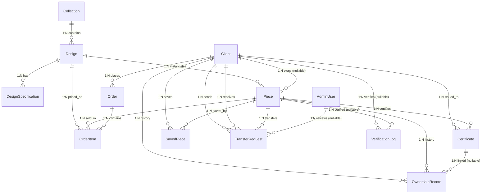

# DADAN Database Entity Graph

Complete reference for every entity in the DADAN Dijital database: what it is, every property it has, how it connects to every other entity, and what data actually lives in each table in the seeded dev environment.

Source of truth: [`packages/db/prisma/schema.prisma`](../packages/db/prisma/schema.prisma) — **16 models · 10 enums · PostgreSQL via Prisma 6**. Seed data comes from [`packages/db/prisma/seed-data.ts`](../packages/db/prisma/seed-data.ts) (the canonical dataset), executed by [`packages/db/prisma/seed.ts`](../packages/db/prisma/seed.ts) with assets handled by [`packages/db/prisma/seed-assets.ts`](../packages/db/prisma/seed-assets.ts). For a relationship-only view see [`packages/db/MODELS.md`](../packages/db/MODELS.md); this document supersedes it in detail but does not replace it.

---

## 1. Full entity relationship graph

`SavedPiece` is drawn as two 1:N edges above but is really an `M:N` join between `Client` and `Piece` with composite primary key `(clientId, pieceId)`.

### Tables without a Prisma foreign key

| Model        | References                                         | Why no FK                                                                                                                                        |
| ------------ | -------------------------------------------------- | ------------------------------------------------------------------------------------------------------------------------------------------------ |
| **CartItem** | `clientId`, `pieceId` (plain strings, indexed)     | Deliberately unlinked — a lightweight, fast-expiring hold; no cascade behavior wanted when a client/piece changes.                               |
| **AuditLog** | `actorType` + `actorId`, `targetType` + `targetId` | Polymorphic by design — one row can point at a `Client`, `AdminUser`, or system actor acting on any target model, so a single FK isn't possible. |

---

## 2. Per-entity reference

Each entity below lists its **role**, every **property**, its **relations**, and the **actual rows** present after running `pnpm --filter @dadan/db db:seed`.

### Client

**Role:** Invitation-only platform user, authenticated by a secret "House Key" (bcrypt-hashed) rather than a password.

| Property           | Type     | Constraints               | Meaning                                                                                |
| ------------------ | -------- | ------------------------- | -------------------------------------------------------------------------------------- |
| `id`               | String   | PK, `uuid()`              | Primary key.                                                                           |
| `houseKey`         | String   | unique                    | Bcrypt hash of the invitation key; never stored in plaintext.                          |
| `houseKeyPrefix`   | String   | indexed (with `isActive`) | First chars of the plaintext key, used to narrow lookup before the bcrypt compare.     |
| `displayName`      | String   | required                  | Name shown in UI (may be Arabic).                                                      |
| `email`            | String   | unique                    | Contact/login-adjacent identifier.                                                     |
| `phone`            | String?  | optional                  | Contact phone.                                                                         |
| `locale`           | String   | default `"ar"`            | Preferred UI language (`ar`/`en`).                                                     |
| `isActive`         | Boolean  | default `true`            | Soft-disable flag for revoking access.                                                 |
| `visibilityGroups` | String[] | —                         | Tags controlling which collections/designs this client can see (e.g. `vip`, `riyadh`). |
| `createdAt`        | DateTime | default `now()`           | Row creation time.                                                                     |
| `updatedAt`        | DateTime | `@updatedAt`              | Auto-updated on write.                                                                 |

**Relations:** owns many `Piece` (`PieceOwner`, nullable), has many `SavedPiece`, sends/receives many `TransferRequest` (`TransferSender`/`TransferRecipient`), has many `VerificationLog`, `Order`, `OwnershipRecord`, `Certificate`.

**Seed rows (3):**

| displayName                    | email              | locale | houseKeyPrefix (plaintext key) | visibilityGroups                                                    |
| ------------------------------ | ------------------ | ------ | ------------------------------ | ------------------------------------------------------------------- |
| أميرة الراشد (Amira Al-Rashid) | amira@example.com  | ar     | `dada` (`dadan-vip-key-001`)   | vip, collection-noir, collection-oasis, collection-mawaddah, riyadh |
| خالد الفارسي (Khalid Al-Farsi) | khalid@example.com | ar     | `dada` (`dadan-key-002`)       | standard, collection-heritage, riyadh                               |
| Layla Al-Mutairi               | layla@example.com  | en     | `dada` (`dadan-key-003`)       | vip, collection-heritage, collection-oasis                          |

---

### Collection

**Role:** Curated, bilingual catalog grouping shown to clients (e.g. "Collection Noir").

| Property                  | Type     | Constraints    | Meaning                                          |
| ------------------------- | -------- | -------------- | ------------------------------------------------ |
| `id`                      | String   | PK, `uuid()`   | Primary key.                                     |
| `name`                    | String   | required       | English display name.                            |
| `nameAr`                  | String?  | optional       | Arabic name; falls back to `name` when null.     |
| `slug`                    | String   | unique         | URL-safe identifier.                             |
| `description`             | String?  | optional       | English description.                             |
| `descriptionAr`           | String?  | optional       | Arabic description; falls back to `description`. |
| `coverImageUrl`           | String?  | optional       | Storage key for cover image.                     |
| `isVisible`               | Boolean  | default `true` | Whether shown in the public catalog.             |
| `sortOrder`               | Int      | default `0`    | Display ordering.                                |
| `visibilityGroups`        | String[] | —              | Groups allowed to see this collection.           |
| `createdAt` / `updatedAt` | DateTime | auto           | Timestamps.                                      |

**Relations:** has many `Design`.

**Seed rows (4):**

| name / nameAr                 | slug              | sortOrder | visibilityGroups                   |
| ----------------------------- | ----------------- | --------- | ---------------------------------- |
| Collection Noir / تشكيلة نوار | `noir-collection` | 1         | vip, collection-noir               |
| Gold Heritage / تراث الذهب    | `gold-heritage`   | 2         | vip, collection-heritage, standard |
| Oasis / الواحة                | `oasis`           | 3         | vip, collection-oasis              |
| Mawaddah / مودّة              | `mawaddah`        | 4         | vip, collection-mawaddah           |

Each collection also stores a `coverImageLqip` (base64 webp data URL) generated from its `seeder-assets` cover for blur-up loading.

---

### Design

**Role:** A product template/blueprint (jewelry design) — not a physical item. Each `Design` can be instantiated into many physical `Piece` rows.

| Property                      | Type                          | Constraints         | Meaning                            |
| ----------------------------- | ----------------------------- | ------------------- | ---------------------------------- |
| `id`                          | String                        | PK, `uuid()`        | Primary key.                       |
| `name` / `nameAr`             | String / String?              | required / optional | Bilingual display name.            |
| `slug`                        | String                        | unique              | URL-safe identifier.               |
| `collectionId`                | String                        | FK → Collection     | Parent collection.                 |
| `story` / `storyAr`           | String (`@db.Text`) / String? | required / optional | Bilingual marketing narrative.     |
| `material` / `materialAr`     | String / String?              | required / optional | Bilingual material description.    |
| `weight`                      | Decimal(10,3)                 | required            | Weight in grams.                   |
| `dimensions` / `dimensionsAr` | String / String?              | required / optional | Bilingual size description.        |
| `imageUrls`                   | String[]                      | —                   | Storage keys for product photos.   |
| `basePrice`                   | Decimal(12,2)                 | required            | List price before tax.             |
| `currency`                    | String                        | default `"SAR"`     | ISO currency code.                 |
| `isActive`                    | Boolean                       | default `true`      | Whether purchasable.               |
| `visibilityGroups`            | String[]                      | —                   | Groups allowed to see this design. |
| `createdAt` / `updatedAt`     | DateTime                      | auto                | Timestamps.                        |

**Relations:** belongs to `Collection`; has many `Piece`, `DesignSpecification`, `OrderItem`.

**Seed rows (8):**

| slug                     | name / nameAr                                  | collection    | material                       | basePrice (SAR) | visibilityGroups                   |
| ------------------------ | ---------------------------------------------- | ------------- | ------------------------------ | --------------- | ---------------------------------- |
| `noir-solitaire-ring`    | Noir Solitaire Ring / خاتم نوار سوليتير        | Noir          | 18K Gold, Black Diamond        | 45,000          | vip, collection-noir               |
| `noir-cascade-necklace`  | Noir Cascade Necklace / عقد نوار المتدرج       | Noir          | 18K Gold, Onyx                 | 62,000          | vip, collection-noir               |
| `heritage-cuff-bracelet` | Heritage Cuff Bracelet / سوار التراث           | Gold Heritage | 22K Gold                       | 78,000          | vip, collection-heritage, standard |
| `heritage-drop-earrings` | Heritage Drop Earrings / أقراط التراث المتدلية | Gold Heritage | 18K Gold, Emerald              | 55,000          | collection-heritage, standard      |
| `oasis-duet-ring`        | Oasis Duet Ring / خاتم الواحة الثنائي          | Oasis         | 18K Rose & White Gold, Diamond | 41,000          | vip, collection-oasis              |
| `oasis-pearl-choker`     | Oasis Pearl Choker / طوق الواحة باللؤلؤ        | Oasis         | 18K White Gold, Pearl, Diamond | 145,000         | vip, collection-oasis              |
| `mawaddah-eternity-band` | Mawaddah Eternity Band / خاتم مودّة الأبدي     | Mawaddah      | 18K Rose Gold, Diamond         | 36,000          | vip, collection-mawaddah           |
| `mawaddah-pendant-heart` | Mawaddah Heart Pendant / قلادة مودّة القلب     | Mawaddah      | 18K Gold, Diamond              | 28,000          | vip, collection-mawaddah           |

Every design has 2–3 `imageUrls`/`imageLqips` entries pointing at its `seeder-assets` files (e.g. `designs/seed/product-1.avif`).

---

### DesignSpecification

**Role:** A single key/value spec line item shown on a design's detail page (e.g. "Stone: Black Diamond").

| Property            | Type             | Constraints                      | Meaning                                      |
| ------------------- | ---------------- | -------------------------------- | -------------------------------------------- |
| `id`                | String           | PK, `uuid()`                     | Primary key.                                 |
| `designId`          | String           | FK → Design, `onDelete: Cascade` | Parent design.                               |
| `key` / `keyAr`     | String / String? | required / optional              | Bilingual spec label (e.g. "Stone").         |
| `value` / `valueAr` | String / String? | required / optional              | Bilingual spec value (e.g. "Black Diamond"). |
| `sortOrder`         | Int              | default `0`                      | Display ordering within the design.          |

**Relations:** belongs to `Design`.

**Seed rows (12 total, 1–2 per design):** e.g. `noir-solitaire-ring` → `Stone: Black Diamond` (sortOrder 1), `Carat: 1.2 ct` (sortOrder 2); `heritage-cuff-bracelet` → `Engraving: Hand-engraved calligraphy`; `oasis-pearl-choker` → `Pearls: South Sea`. Every seeded design has at least one specification row; see `DESIGNS[].specifications` in `seed-data.ts` for the full set.

---

### Piece

**Role:** A physical, individually numbered jewelry item instantiated from a `Design`. The core "digital twin" entity the whole authenticity/ownership system revolves around.

| Property                  | Type        | Constraints                        | Meaning                                                                 |
| ------------------------- | ----------- | ---------------------------------- | ----------------------------------------------------------------------- |
| `id`                      | String      | PK, `uuid()`                       | Primary key.                                                            |
| `serialNumber`            | String      | unique                             | Immutable, human-readable serial engraved/printed on the physical item. |
| `designId`                | String      | FK → Design, indexed with `status` | Which design this piece instantiates.                                   |
| `currentOwnerId`          | String?     | FK → Client, indexed, nullable     | Current owner; null while unsold/available.                             |
| `status`                  | PieceStatus | default `AVAILABLE`                | Lifecycle state (see enum table).                                       |
| `registeredAt`            | DateTime    | default `now()`                    | When the physical piece was registered into the system.                 |
| `createdAt` / `updatedAt` | DateTime    | auto                               | Timestamps.                                                             |

**Relations:** belongs to `Design` and (optionally) `Client` (owner); has many `OwnershipRecord`, `Certificate`, `TransferRequest`, `VerificationLog`, `OrderItem`, `SavedPiece`.

**Seed rows (16):**

| serialNumber         | design                 | owner  | status                                      |
| -------------------- | ---------------------- | ------ | ------------------------------------------- |
| DADAN-2026-NC-000001 | noir-solitaire-ring    | Amira  | TRANSFER*PENDING *(after seeded transfer)\_ |
| DADAN-2026-NC-000002 | noir-solitaire-ring    | —      | AVAILABLE                                   |
| DADAN-2026-NC-000003 | noir-cascade-necklace  | —      | AVAILABLE                                   |
| DADAN-2026-NC-000004 | noir-cascade-necklace  | —      | AVAILABLE                                   |
| DADAN-2026-GH-000001 | heritage-cuff-bracelet | Khalid | OWNED                                       |
| DADAN-2026-GH-000002 | heritage-cuff-bracelet | —      | AVAILABLE                                   |
| DADAN-2026-GH-000003 | heritage-drop-earrings | —      | AVAILABLE                                   |
| DADAN-2026-GH-000004 | heritage-drop-earrings | —      | AVAILABLE                                   |
| DADAN-2026-OA-000001 | oasis-duet-ring        | Layla  | OWNED                                       |
| DADAN-2026-OA-000002 | oasis-duet-ring        | —      | AVAILABLE                                   |
| DADAN-2026-OA-000003 | oasis-pearl-choker     | —      | AVAILABLE                                   |
| DADAN-2026-OA-000004 | oasis-pearl-choker     | —      | AVAILABLE                                   |
| DADAN-2026-MA-000001 | mawaddah-eternity-band | Amira  | OWNED                                       |
| DADAN-2026-MA-000002 | mawaddah-eternity-band | —      | AVAILABLE                                   |
| DADAN-2026-MA-000003 | mawaddah-pendant-heart | —      | AVAILABLE                                   |
| DADAN-2026-MA-000004 | mawaddah-pendant-heart | —      | AVAILABLE                                   |

---

### OwnershipRecord

**Role:** Append-only ledger of ownership events for a piece. Never delete rows (enforced in the API service layer, not by the DB).

| Property          | Type            | Constraints                | Meaning                                              |
| ----------------- | --------------- | -------------------------- | ---------------------------------------------------- |
| `id`              | String          | PK, `uuid()`               | Primary key.                                         |
| `pieceId`         | String          | FK → Piece                 | Which piece this event is about.                     |
| `clientId`        | String          | FK → Client                | Owner as of this event.                              |
| `acquiredAt`      | DateTime        | default `now()`            | When ownership began.                                |
| `transferredAt`   | DateTime?       | optional                   | When ownership ended (null = current owner).         |
| `acquisitionType` | AcquisitionType | required                   | How it was acquired (see enum table).                |
| `notes`           | String?         | optional                   | Free-text context.                                   |
| `certificateId`   | String?         | FK → Certificate, optional | Certificate issued for this ownership event, if any. |

**Relations:** belongs to `Piece` and `Client`; optionally linked to a `Certificate`.

**Seed rows (4):** one `PURCHASE` record per initially-owned piece — Amira/`DADAN-2026-NC-000001` and `DADAN-2026-MA-000001`, Khalid/`DADAN-2026-GH-000001`, Layla/`DADAN-2026-OA-000001` — each with note `"Initial seed ownership"`. Further rows (transfers, additional purchases) are created at runtime by the transfer/order services, not by the seed script.

---

### Certificate

**Role:** Digital authenticity certificate for a piece — a signed PDF plus a QR code that resolves to the public verification page.

| Property                  | Type     | Constraints                         | Meaning                                                                             |
| ------------------------- | -------- | ----------------------------------- | ----------------------------------------------------------------------------------- |
| `id`                      | String   | PK, `uuid()`                        | Primary key.                                                                        |
| `pieceId`                 | String   | FK → Piece, indexed with `isActive` | Piece being certified.                                                              |
| `ownerId`                 | String   | FK → Client                         | Owner at time of issuance.                                                          |
| `certificateNumber`       | String   | unique                              | Human-readable certificate ID.                                                      |
| `issuedAt`                | DateTime | default `now()`                     | Issuance timestamp.                                                                 |
| `isActive`                | Boolean  | default `true`                      | Whether this certificate is the current valid one.                                  |
| `pdfUrl`                  | String?  | optional                            | **Storage object key** (not a public URL) for the generated PDF.                    |
| `qrCodeData`              | String   | required                            | Full verify URL encoded in the QR (`.../verify?serial=...&token=...`), HMAC-signed. |
| `templateVersion`         | String   | default `"1.0"`                     | Which PDF template version was used.                                                |
| `createdAt` / `updatedAt` | DateTime | auto                                | Timestamps.                                                                         |

**Relations:** belongs to `Piece` and `Client` (owner); has many `OwnershipRecord`.

**Seed rows (4):**

| certificateNumber  | serial               | owner  |
| ------------------ | -------------------- | ------ |
| CERT-2026-A3F1C09B | DADAN-2026-NC-000001 | Amira  |
| CERT-2026-B7E2D04A | DADAN-2026-GH-000001 | Khalid |
| CERT-2026-C1D4E88F | DADAN-2026-OA-000001 | Layla  |
| CERT-2026-D9A6F21C | DADAN-2026-MA-000001 | Amira  |

---

### Order

**Role:** A purchase transaction placed by a client, containing one or more pieces.

| Property                  | Type          | Constraints                        | Meaning                             |
| ------------------------- | ------------- | ---------------------------------- | ----------------------------------- |
| `id`                      | String        | PK, `uuid()`                       | Primary key.                        |
| `clientId`                | String        | FK → Client, indexed with `status` | Purchaser.                          |
| `status`                  | OrderStatus   | default `PENDING`                  | Fulfillment state (see enum table). |
| `totalAmount`             | Decimal(12,2) | required                           | Total charged, incl. tax.           |
| `currency`                | String        | default `"SAR"`                    | ISO currency code.                  |
| `paymentProvider`         | String        | required                           | e.g. `"mock"` in dev.               |
| `paymentMethod`           | String?       | optional                           | e.g. `"MADA"`.                      |
| `paymentReference`        | String?       | indexed                            | External payment gateway reference. |
| `shippingAddress`         | Json          | required                           | Structured address object.          |
| `placedAt`                | DateTime      | default `now()`                    | When the order was placed.          |
| `createdAt` / `updatedAt` | DateTime      | auto                               | Timestamps.                         |

**Relations:** belongs to `Client`; has many `OrderItem`.

**Seed rows (3):**

| client | pieces                                     | status    | paymentMethod | paymentReference            |
| ------ | ------------------------------------------ | --------- | ------------- | --------------------------- |
| Amira  | DADAN-2026-NC-000001, DADAN-2026-MA-000001 | FULFILLED | MADA          | `seed_DADAN-2026-NC-000001` |
| Khalid | DADAN-2026-GH-000001                       | PAID      | MADA          | `seed_DADAN-2026-GH-000001` |
| Layla  | DADAN-2026-OA-000001                       | FULFILLED | MADA          | `seed_DADAN-2026-OA-000001` |

Each `totalAmount` = sum of the pieces' design `basePrice` × 1.15 (15% VAT), rounded to 2 decimals. `shippingAddress` is identical mock data for all three: King Fahd Road, Riyadh, SA 11564.

---

### OrderItem

**Role:** A line item snapshot within an order — freezes the price at the moment of purchase, independent of later `Design.basePrice` changes.

| Property          | Type          | Constraints                     | Meaning                                                                      |
| ----------------- | ------------- | ------------------------------- | ---------------------------------------------------------------------------- |
| `id`              | String        | PK, `uuid()`                    | Primary key.                                                                 |
| `orderId`         | String        | FK → Order, `onDelete: Cascade` | Parent order.                                                                |
| `pieceId`         | String        | FK → Piece                      | The specific physical piece sold.                                            |
| `designId`        | String        | FK → Design                     | Denormalized design reference (for reporting without joining through Piece). |
| `priceAtPurchase` | Decimal(12,2) | required                        | Price locked in at purchase time.                                            |

**Relations:** belongs to `Order`, `Piece`, `Design`.

**Seed rows (4):** one per seeded order item — `DADAN-2026-NC-000001` and `DADAN-2026-MA-000001` under Amira's order, `DADAN-2026-GH-000001` under Khalid's order, `DADAN-2026-OA-000001` under Layla's order — each priced at the design's `basePrice`.

---

### SavedPiece

**Role:** Client wishlist entry — an M:N join table between `Client` and `Piece`.

| Property   | Type     | Constraints                                      | Meaning               |
| ---------- | -------- | ------------------------------------------------ | --------------------- |
| `clientId` | String   | PK (composite), FK → Client, `onDelete: Cascade` | Client who saved it.  |
| `pieceId`  | String   | PK (composite), FK → Piece, `onDelete: Cascade`  | Piece that was saved. |
| `savedAt`  | DateTime | default `now()`                                  | When it was saved.    |

**Relations:** belongs to `Client` and `Piece`; composite PK `(clientId, pieceId)` prevents duplicate saves.

**Seed rows (6):**

| client | saved piece          |
| ------ | -------------------- |
| Amira  | DADAN-2026-OA-000003 |
| Amira  | DADAN-2026-GH-000002 |
| Khalid | DADAN-2026-MA-000004 |
| Khalid | DADAN-2026-NC-000004 |
| Layla  | DADAN-2026-NC-000002 |
| Layla  | DADAN-2026-GH-000004 |

---

### TransferRequest

**Role:** Multi-step ownership transfer workflow (sale/gift/inheritance) between two clients, with a DADAN staff review gate. Status transitions are forward-only (enforced in the service layer).

| Property               | Type           | Constraints                                | Meaning                                                   |
| ---------------------- | -------------- | ------------------------------------------ | --------------------------------------------------------- |
| `id`                   | String         | PK, `uuid()`                               | Primary key.                                              |
| `pieceId`              | String         | FK → Piece, indexed with `status`          | Piece being transferred.                                  |
| `fromClientId`         | String         | FK → Client (`TransferSender`), indexed    | Current owner initiating/consenting.                      |
| `toClientId`           | String         | FK → Client (`TransferRecipient`), indexed | Recipient.                                                |
| `transferType`         | TransferType   | required                                   | `SALE` \| `GIFT` \| `INHERITANCE`.                        |
| `status`               | TransferStatus | default `INITIATED`, indexed               | Workflow stage (see enum table).                          |
| `senderConfirmedAt`    | DateTime?      | optional                                   | When sender confirmed.                                    |
| `recipientConfirmedAt` | DateTime?      | optional                                   | When recipient confirmed.                                 |
| `dadanReviewedAt`      | DateTime?      | optional                                   | When staff reviewed.                                      |
| `dadanReviewedBy`      | String?        | FK → AdminUser, optional                   | Reviewing staff member.                                   |
| `dadanNotes`           | String?        | optional                                   | Staff review notes.                                       |
| `initiatedAt`          | DateTime       | default `now()`                            | When the transfer was started.                            |
| `completedAt`          | DateTime?      | optional                                   | When the transfer finished (approved/rejected/cancelled). |

**Relations:** belongs to `Piece`, two `Client` relations (sender/recipient), optionally reviewed by `AdminUser`.

**Seed rows (1):**

| piece                | from → to      | type | status                                              |
| -------------------- | -------------- | ---- | --------------------------------------------------- |
| DADAN-2026-NC-000001 | Amira → Khalid | GIFT | DADAN_REVIEW (sender + recipient already confirmed) |

The transferred piece is set to `PieceStatus.TRANSFER_PENDING` as part of seeding.

---

### VerificationLog

**Role:** Public audit trail of every "verify this piece by serial number" lookup — including failed lookups for serials that don't exist.

| Property       | Type               | Constraints           | Meaning                                                                                       |
| -------------- | ------------------ | --------------------- | --------------------------------------------------------------------------------------------- |
| `id`           | String             | PK, `uuid()`          | Primary key.                                                                                  |
| `pieceId`      | String?            | FK → Piece, optional  | Matched piece, if found.                                                                      |
| `serialNumber` | String             | required              | The serial that was queried (kept even if not found).                                         |
| `verifiedAt`   | DateTime           | default `now()`       | When the check happened.                                                                      |
| `ipAddress`    | String?            | optional              | Requester IP, for abuse monitoring.                                                           |
| `clientId`     | String?            | FK → Client, optional | Logged-in client who performed the check, if any (public verification doesn't require login). |
| `result`       | VerificationResult | required              | `FOUND` \| `NOT_FOUND`.                                                                       |

**Relations:** optionally belongs to `Piece` and `Client`.

**Seed rows:** none. Rows are created at runtime by `apps/api/src/verify/verify.service.ts` every time the public `/verify` endpoint is called.

---

### AdminUser

**Role:** DADAN staff account — email/password authenticated, used for the admin/back-office side (catalog management, transfer review).

| Property                  | Type      | Constraints     | Meaning                           |
| ------------------------- | --------- | --------------- | --------------------------------- |
| `id`                      | String    | PK, `uuid()`    | Primary key.                      |
| `email`                   | String    | unique          | Login identifier.                 |
| `passwordHash`            | String    | required        | Bcrypt password hash.             |
| `displayName`             | String    | required        | Staff display name.               |
| `role`                    | AdminRole | default `STAFF` | Permission tier (see enum table). |
| `isActive`                | Boolean   | default `true`  | Soft-disable flag.                |
| `createdAt` / `updatedAt` | DateTime  | auto            | Timestamps.                       |

**Relations:** has many `TransferRequest` (as reviewer).

**Seed rows (3):**

| email           | displayName       | role        | password (dev only) |
| --------------- | ----------------- | ----------- | ------------------- |
| admin@dadan.sa  | DADAN Super Admin | SUPER_ADMIN | `AdminPass123!`     |
| staff@dadan.sa  | DADAN Staff       | STAFF       | `AdminPass123!`     |
| viewer@dadan.sa | DADAN Viewer      | VIEWER      | `AdminPass123!`     |

---

### AuditLog

**Role:** Immutable, polymorphic action trail — records who (client/admin/system) did what to which entity, across the whole app.

| Property     | Type      | Constraints     | Meaning                                                     |
| ------------ | --------- | --------------- | ----------------------------------------------------------- |
| `id`         | String    | PK, `uuid()`    | Primary key.                                                |
| `actorType`  | ActorType | required        | `CLIENT` \| `ADMIN` \| `SYSTEM`.                            |
| `actorId`    | String    | required        | ID of the actor (interpreted per `actorType`; not a DB FK). |
| `action`     | String    | required        | Action name/code (e.g. `"transfer.approved"`).              |
| `targetType` | String?   | optional        | Model name the action targeted (e.g. `"Piece"`).            |
| `targetId`   | String?   | optional        | ID of the targeted row.                                     |
| `metadata`   | Json?     | optional        | Arbitrary extra context.                                    |
| `createdAt`  | DateTime  | default `now()` | When the action occurred.                                   |

**Relations:** none (polymorphic by convention, no FKs).

**Seed rows:** none. Populated at runtime by `apps/api/src/audit/audit.service.ts` whenever a tracked action occurs (e.g. admin approves a transfer, order status changes).

---

### CartItem

**Role:** Temporary reservation ("hold") on a piece while a client is checking out, so two clients can't buy the same one-of-a-kind piece simultaneously.

| Property    | Type     | Constraints         | Meaning                                                                                                    |
| ----------- | -------- | ------------------- | ---------------------------------------------------------------------------------------------------------- |
| `id`        | String   | PK, `uuid()`        | Primary key.                                                                                               |
| `clientId`  | String   | indexed             | Client holding the piece (no DB FK).                                                                       |
| `pieceId`   | String   | **unique**, indexed | Piece being held — global uniqueness means only one active hold per piece at a time.                       |
| `addedAt`   | DateTime | default `now()`     | When the hold started.                                                                                     |
| `expiresAt` | DateTime | indexed             | When the hold auto-releases (30 minutes after `addedAt`, enforced in `apps/api/src/cart/cart.service.ts`). |

**Relations:** none (no DB FK; linked by convention to `Client`/`Piece`).

**Seed rows (1):** Amira holds `DADAN-2026-OA-000004` in her cart with a 7-day expiry.

---

## 3. Enums reference

| Enum                 | Values                                                                                                      | Used by                           |
| -------------------- | ----------------------------------------------------------------------------------------------------------- | --------------------------------- |
| `PieceStatus`        | `AVAILABLE`, `OWNED`, `TRANSFER_PENDING`, `RETIRED`                                                         | `Piece.status`                    |
| `AcquisitionType`    | `PURCHASE`, `GIFT`, `INHERITANCE`, `ADMIN_ASSIGNMENT`                                                       | `OwnershipRecord.acquisitionType` |
| `TransferType`       | `SALE`, `GIFT`, `INHERITANCE`                                                                               | `TransferRequest.transferType`    |
| `TransferStatus`     | `INITIATED`, `SENDER_CONFIRMED`, `RECIPIENT_CONFIRMED`, `DADAN_REVIEW`, `APPROVED`, `REJECTED`, `CANCELLED` | `TransferRequest.status`          |
| `OrderStatus`        | `PENDING`, `PAID`, `PROCESSING`, `FULFILLED`, `CANCELLED`                                                   | `Order.status`                    |
| `PaymentStatus`      | `PENDING`, `AUTHORIZED`, `PAID`, `FAILED`, `PARTIALLY_REFUNDED`, `REFUNDED`, `DISPUTED`                     | `Order.paymentStatus`             |
| `FulfillmentStatus`  | `UNFULFILLED`, `PROCESSING`, `SHIPPED`, `DELIVERED`, `RETURNED`                                             | `Order.fulfillmentStatus`         |
| `VerificationResult` | `FOUND`, `NOT_FOUND`                                                                                        | `VerificationLog.result`          |
| `AdminRole`          | `SUPER_ADMIN`, `STAFF`, `VIEWER`                                                                            | `AdminUser.role`                  |
| `ActorType`          | `CLIENT`, `ADMIN`, `SYSTEM`                                                                                 | `AuditLog.actorType`              |

---

## 4. Cross-cutting rules (service layer, not DB constraints)

- **`OwnershipRecord` is append-only** — rows are never deleted or overwritten once created, even when ownership changes; a new row is added instead.
- **`TransferRequest.status` moves forward only** — `INITIATED → SENDER_CONFIRMED → RECIPIENT_CONFIRMED → DADAN_REVIEW → APPROVED/REJECTED`, or `CANCELLED` from any pre-terminal state. The DB does not enforce this; the transfer service does.
- **`CartItem.pieceId` is globally unique** — a piece can only be held by one client's cart at a time, with a 30-minute expiry window, since each piece is a one-of-a-kind physical item.
- **`Certificate.pdfUrl` stores an S3-style storage object key**, not a public URL — the API generates a signed/temporary URL on demand.
- **Bilingual fields fall back to English** — every `*Ar` field (`nameAr`, `descriptionAr`, `storyAr`, `materialAr`, `dimensionsAr`, `keyAr`, `valueAr`) is optional and falls back to its non-Arabic counterpart when null.
- **`visibilityGroups`** (on `Client`, `Collection`, `Design`) implement a tag-based access-control scheme (`packages/utils/src/index.ts#hasVisibilityAccess`): an item with an empty `visibilityGroups` array is visible to everyone; an item tagged `admin-only` is hidden from all clients; otherwise a client can see the item only if at least one of their groups overlaps with the item's groups (case-insensitive, whitespace-normalized).
