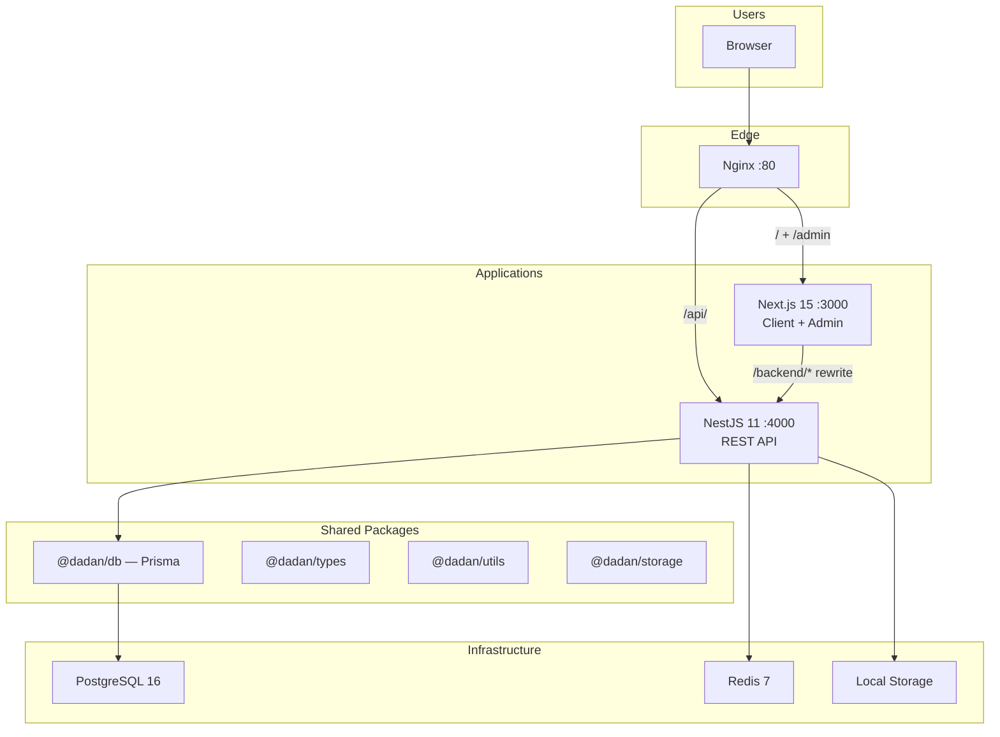
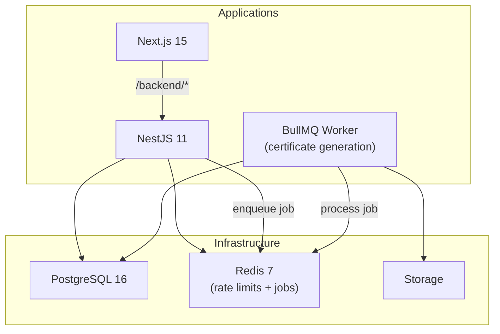
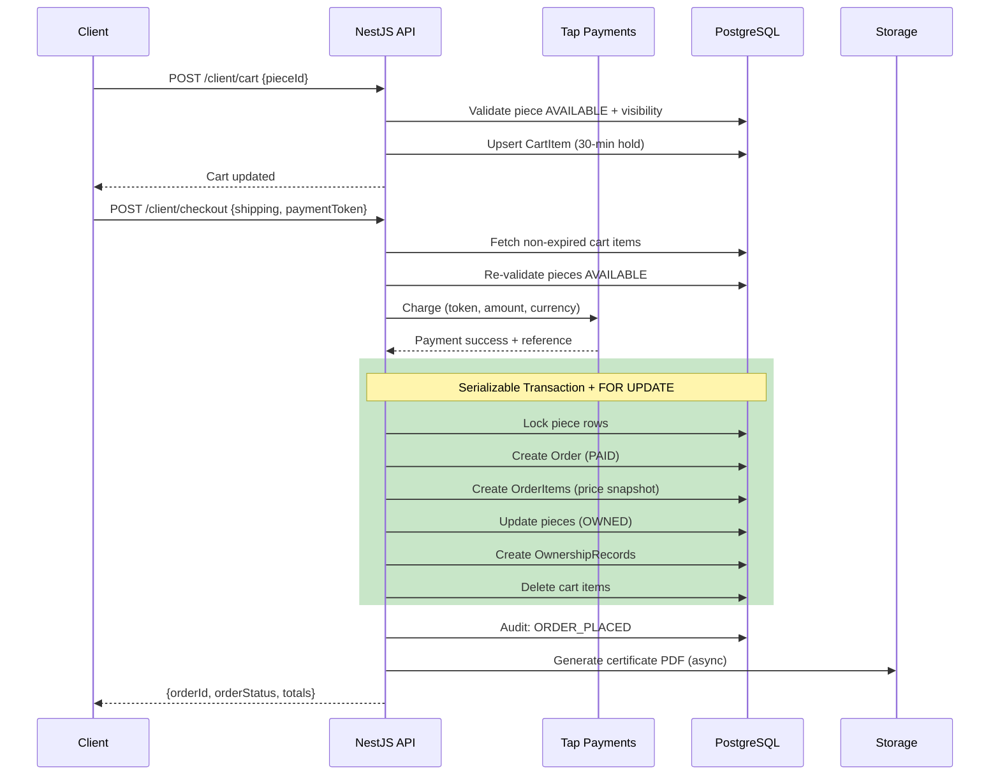

# DADAN Dijital -- Full Backend, Database, PRD & Architecture Review

> **Reviewer:** AI Principal Architect Review  
> **Date:** July 29, 2026  
> **Scope:** Complete codebase review against PRD across 20 assessment dimensions  
> **Stack:** NestJS 11 + Prisma 6 + PostgreSQL 16 + Redis 7 (Turborepo monorepo)

---

## A. Executive Summary

DADAN Dijital is a well-engineered luxury digital jewelry platform with strong security foundations, comprehensive audit logging, and correct implementation of its core business rules. The architecture is appropriate for the product's size and ambition. However, the codebase has critical gaps in financial correctness, test coverage, and background processing reliability that must be resolved before production release.

### Scores (1-10)

| Dimension                      | Score | Rationale                                                                                                                                                                                                                               |
| ------------------------------ | ----- | --------------------------------------------------------------------------------------------------------------------------------------------------------------------------------------------------------------------------------------- |
| **PRD Compliance**             | **8** | 40 of ~45 requirements fully implemented. 10 gaps identified, mostly low-severity. Core non-negotiable rules (House Key, ownership, transfers, certificates, verification) all correct.                                                 |
| **Business-Logic Correctness** | **7** | Core flows correct with serializable transactions and row locking. Order status FSM unguarded. Piece status transitions partially unguarded. Saved pieces not cleaned on ownership change.                                              |
| **Database Design**            | **8** | Well-normalized schema with Decimal(12,2) for money, partial unique indexes for business invariants, proper enums. Missing: CartItem FKs, financial check constraints, several query indexes.                                           |
| **Architecture**               | **8** | Clean feature-module monolith, correct for product size. Default-deny auth guard is excellent. `forwardRef` cycles should be resolved with events. No premature complexity.                                                             |
| **Security**                   | **8** | Strong auth (bcrypt, audience-separated JWTs, refresh rotation with reuse detection, token deny-list). One High finding: path traversal in `/uploads`. Two Medium: missing MIME filter, refresh rate limiting. No IDOR vulnerabilities. |
| **Performance**                | **6** | N+1 `resolvePublicUrls` pattern in every list endpoint. Homepage query loads all pieces to count them. In-memory pagination in collection detail. Acceptable at current scale but degrades with growth.                                 |
| **Scalability**                | **7** | Stateless JWT auth, Redis-backed rate limiting. Certificate generation is CPU-bound in-process (bottleneck under load). No job queue. Single-VPS deployment with path to horizontal scaling.                                            |
| **Reliability**                | **5** | Certificate retries use `setTimeout` (lost on restart). Refund failures silently logged. No alerting. No dead-letter mechanism. Idempotency key is random (not truly idempotent).                                                       |
| **Observability**              | **6** | Good structured JSON logging, request IDs, comprehensive audit log. No application metrics endpoint. No alerting. No correlation of clientId in service-layer logs.                                                                     |
| **Test Coverage**              | **3** | Only 5 test files for the entire API. Zero tests for orders, payments, transfers, certificates, cart, or admin operations. No concurrent checkout tests. No IDOR tests.                                                                 |
| **Maintainability**            | **7** | Clean module separation, consistent patterns, good documentation. Inline DTOs reduce reusability. Raw Prisma entities returned from some endpoints (fragile).                                                                           |
| **Production Readiness**       | **5** | Strong deployment infrastructure (Docker, rollback, backups) but critical gaps in financial correctness, test coverage, and reliability prevent a confident production launch.                                                          |

### Most Serious Risks

1. **Idempotency key uses `randomUUID()`** -- duplicate charges possible on retry (Critical)
2. **Near-zero test coverage** on financial and transfer logic (Critical)
3. **Certificate generation lost on process restart** -- `setTimeout` is not durable (High)
4. **Tax rounding mismatch** between cart and order creation (High)
5. **Path traversal** in `/uploads` controller (High)
6. **Failed refunds silently logged** with no recovery mechanism (High)

---

## B. PRD Compliance Matrix

| Requirement                        | Expected Behavior                      | Implementation Location                                                                   | Status        | Evidence                                                                                          | Gap                                                                  | Recommendation           |
| ---------------------------------- | -------------------------------------- | ----------------------------------------------------------------------------------------- | ------------- | ------------------------------------------------------------------------------------------------- | -------------------------------------------------------------------- | ------------------------ |
| Private access (House Key only)    | All client endpoints gated             | `client.guard.ts`, all client controllers use `@UseGuards(ClientGuard)`                   | **Complete**  | Guard verifies JWT audience, checks `isActive` in DB, deny-list check                             | --                                                                   | --                       |
| House Key permanent, unique, 1:1   | Cannot delete; only rotate             | `schema.prisma` `@unique`; `clients.service.ts` `rotateKey` SUPER_ADMIN only              | **Complete**  | DB unique constraint; bcrypt hash stored; plaintext shown once                                    | --                                                                   | --                       |
| Client name throughout experience  | `displayName` in JWT and all responses | `client.guard.ts` attaches to request; `home.service.ts` uses localization                | **Complete**  | `ClientSession` carries `displayName`                                                             | --                                                                   | --                       |
| Client-specific product visibility | Visibility groups filter catalog       | `visibility.service.ts`, `collections.service.ts`, `packages/utils` `hasVisibilityAccess` | **Complete**  | Collections + Designs filtered; denial returns 404 not 403                                        | --                                                                   | --                       |
| Direct purchase checkout           | Cart + payment + order                 | `cart.service.ts`, `checkout.controller.ts`, `orders.service.ts`                          | **Complete**  | 30-min hold, payment charge, atomic order with `FOR UPDATE`                                       | --                                                                   | --                       |
| Jewelry Wardrobe                   | Owned pieces with cert access          | `client-wardrobe.controller.ts`, `pieces.service.ts`                                      | **Complete**  | Queries by `currentOwnerId`, includes design, specs, certificate                                  | --                                                                   | --                       |
| Saved Pieces (Favorites)           | Idempotent save/unsave                 | `client-saved.controller.ts`, `pieces.service.ts`                                         | **Complete**  | Composite PK; visibility validated on save                                                        | --                                                                   | --                       |
| Digital Certificate (PDF)          | Generated on ownership events          | `certificates.service.ts`                                                                 | **Complete**  | PDF with QR, HMAC token, Arabic support, luxury template                                          | --                                                                   | --                       |
| Certificate archive                | Previous certs kept                    | `certificates.service.ts:116-118` sets `isActive: false`                                  | **Complete**  | Old certs archived, never deleted                                                                 | --                                                                   | --                       |
| Serial verification                | Public, never reveals owner            | `verify.controller.ts`, `verify.service.ts`                                               | **Partial**   | HMAC-verified, rate-limited, no owner data. Missing: piece image not returned                     | Add signed image URL to response                                     |
| Transfer approval chain            | Sender + recipient + DADAN             | `transfers.service.ts`, `packages/utils canTransitionTransfer`                            | **Complete**  | State machine enforced; approve restricted to SUPER_ADMIN                                         | Minor: `RECIPIENT_CONFIRMED` not persisted (jumps to `DADAN_REVIEW`) | Document as intentional  |
| Admin dashboard                    | Clients, pieces, certs, transfers      | All admin controllers                                                                     | **Complete**  | Full CRUD with RBAC (SUPER_ADMIN, STAFF, VIEWER)                                                  | --                                                                   | --                       |
| RBAC                               | Role-based admin access                | `admin.guard.ts`, `@Roles()` decorator                                                    | **Complete**  | SUPER_ADMIN gates: key rotation, transfer approval, cert regeneration; VIEWER blocked from writes | --                                                                   | --                       |
| Audit logging                      | Every important action logged          | `audit.service.ts`, all services                                                          | **Partial**   | 25+ action types logged. Missing: certificate download not audited                                | Add `CERTIFICATE_DOWNLOADED` audit entry                             |
| Order status management            | Workflow progression                   | `orders.service.ts` `updateOrderStatus`                                                   | **Incorrect** | Admin can set any status freely -- no FSM validation                                              | Implement OrderStatus state machine                                  |
| Admin login security               | Rate limiting recommended              | `admin-auth.service.ts`                                                                   | **Complete**  | Rate limiting on admin login implemented (same constants as client)                               | --                                                                   | --                       |
| Payment integration                | Saudi-compatible gateway               | `payments.service.ts` -- Tap Payments + mock                                              | **Complete**  | CARD, MADA, APPLE_PAY; webhook with HMAC verification                                             | 3DS redirect + native Apple Pay not implemented                      | Document as future phase |
| i18n (ar + en)                     | Full bilingual support                 | `localizeDesign`, `pickLocalized`, `nestjs-i18n`                                          | **Complete**  | Arabic fields on all entities; `Accept-Language` header support                                   | --                                                                   | --                       |

---

## C. Architecture Assessment

### Current Architecture



### Strengths

- **Default-deny auth** -- `GlobalAuthGuard` rejects any route without explicit `@Public()` or `@UseGuards()`. Gold standard for preventing accidentally exposed endpoints.
- **Clean module separation** -- 21 modules with clear single-responsibility boundaries. Admin/client controller split within each module.
- **Shared packages** -- `@dadan/utils`, `@dadan/types`, `@dadan/storage` are leaf dependencies with no upward coupling.
- **Comprehensive audit trail** -- 25+ action types logged immutably.
- **Good documentation** -- Architecture, business logic, and known gaps are self-documented.

### Weaknesses

- **`forwardRef` circular dependencies** -- `PiecesModule`, `OrdersModule`, and `TransfersModule` all use `forwardRef(() => CertificatesModule)`. Should be resolved with `@nestjs/event-emitter`.
- **No job queue** -- Certificate generation retries use `setTimeout` (lost on restart). BullMQ with Redis is the natural choice.
- **Only 2 dedicated DTO files** -- Most DTOs are defined inline in controllers (not reusable, no Swagger `@ApiProperty`).
- **No response interceptor** -- Raw Prisma entities returned from admin endpoints, risking future field leakage.
- **No API versioning** -- Acceptable for single-consumer closed platform today, needed before any external integrations.

### Recommended Architecture Evolution



The primary architectural change is extracting certificate PDF generation into a BullMQ worker process. This provides durable retries, dead-letter handling, and removes CPU-intensive PDF rendering from the API request path.

### Key Business Workflow: Purchase Flow



---

## D. Database Review

### Schema Strengths

- All monetary columns use `Decimal(12,2)` -- correct precision
- Partial unique indexes enforce business invariants (one active cert/transfer/owner per piece)
- CHECK constraints on `Design.weight > 0`, `Design.basePrice >= 0`, and `TransferRequest.fromClientId <> toClientId`
- `OrderItem.priceAtPurchase` snapshots price at time of sale

### Critical Findings

**D-DB-01: CartItem lacks foreign keys** -- `clientId` and `pieceId` have no FK constraints. Orphaned rows accumulate silently after client/piece deletion.

```sql
ALTER TABLE "CartItem"
ADD CONSTRAINT "CartItem_clientId_fkey"
FOREIGN KEY ("clientId") REFERENCES "Client"("id") ON DELETE CASCADE;

ALTER TABLE "CartItem"
ADD CONSTRAINT "CartItem_pieceId_fkey"
FOREIGN KEY ("pieceId") REFERENCES "Piece"("id") ON DELETE CASCADE;
```

**D-DB-02: No check constraints on financial amounts** -- Negative order totals or tax amounts could be stored.

```sql
ALTER TABLE "Order"
ADD CONSTRAINT "order_amounts_nonnegative"
CHECK ("subtotalAmount" >= 0 AND "taxAmount" >= 0 AND "totalAmount" >= 0
  AND "shippingAmount" >= 0 AND "discountAmount" >= 0);
```

**D-DB-03: No Piece status/owner invariant constraint** -- `status = OWNED` without `currentOwnerId` creates invalid state.

```sql
ALTER TABLE "Piece"
ADD CONSTRAINT "piece_owned_has_owner"
CHECK (
  ("status" = 'OWNED' AND "currentOwnerId" IS NOT NULL)
  OR ("status" = 'TRANSFER_PENDING' AND "currentOwnerId" IS NOT NULL)
  OR ("status" IN ('AVAILABLE', 'RETIRED') AND "currentOwnerId" IS NULL)
);
```

### Missing Indexes

| Table                 | Index                      | Query Pattern                                           |
| --------------------- | -------------------------- | ------------------------------------------------------- |
| `AuditLog`            | `(actorId)`                | Admin: "show all actions by client X"                   |
| `AuditLog`            | `(action)`                 | Admin: filter by action type                            |
| `AuditLog`            | `(createdAt DESC)`         | Time-range audit queries                                |
| `OwnershipRecord`     | `(pieceId, transferredAt)` | Find current owner record (WHERE transferredAt IS NULL) |
| `VerificationLog`     | `(serialNumber)`           | Verification history lookup                             |
| `DesignSpecification` | `UNIQUE (designId, key)`   | Prevent duplicate spec keys per design                  |

### Transaction Safety

| Operation                       | Isolation    | Locking                                       | Verdict                                                   |
| ------------------------------- | ------------ | --------------------------------------------- | --------------------------------------------------------- |
| `createPaidOrder`               | Serializable | `FOR UPDATE` on pieces                        | Correct                                                   |
| `transfer.initiate`             | Serializable | `FOR UPDATE` on piece + active transfer check | Correct                                                   |
| `transfer.approve`              | Serializable | `FOR UPDATE` on transfer + piece              | Correct                                                   |
| `transfer.reject`               | Serializable | `FOR UPDATE` on transfer + piece              | Correct                                                   |
| `transfer.cancel`               | Serializable | `FOR UPDATE` on transfer + piece              | Correct                                                   |
| **`transfer.confirmSender`**    | **None**     | **No lock**                                   | **Race condition** -- concurrent cancel can corrupt state |
| **`transfer.confirmRecipient`** | **None**     | **No lock**                                   | **Same race risk**                                        |
| **`cart.addToCart`**            | **None**     | **No lock**                                   | **TOCTOU** -- reservation can be stolen                   |
| **`pieces.assignPiece`**        | Default      | No `FOR UPDATE`                               | **Double-assignment possible**                            |
| `certificates.generate`         | Default      | Partial unique index backstop                 | Acceptable                                                |

---

## E. Detailed Findings

### [Critical] F-01: Idempotency Key Is Random -- Duplicate Charges Possible

- **Category:** Financial
- **Location:** `apps/api/src/cart/cart.service.ts:224`
- **Current behavior:** `idempotencyKey = checkout_${clientId}_${randomUUID()}` -- every attempt generates a unique key
- **Expected behavior:** Deterministic key based on cart contents, checked before charging
- **Why this matters:** Network timeout + retry charges the customer twice. Second order fails at `FOR UPDATE` lock, triggering a refund that takes 5-14 business days.
- **Failure scenario:** User clicks Pay, network times out, user clicks again. Both charges succeed. One order created, one refunded days later.
- **Recommendation:** Compute key from sorted cart piece IDs before charging. Pass to Tap as `Idempotency-Key` header.
- **Priority:** Immediate
- **Effort:** Small

### [Critical] F-02: Failed Refund Silently Logged -- No Recovery

- **Category:** Financial
- **Location:** `apps/api/src/cart/cart.service.ts:296-302`
- **Current behavior:** If refund HTTP call throws, error is logged and swallowed
- **Expected behavior:** Persistent retry mechanism or admin notification
- **Why this matters:** Customer charged with no order and no refund. Only a log line remains.
- **Priority:** Immediate
- **Effort:** Medium

### [High] F-03: Tax Rounding Mismatch Between Cart and Order

- **Category:** Financial
- **Location:** `cart.service.ts:203-205` vs `orders.service.ts:116-119`
- **Current behavior:** Cart computes VAT on aggregate subtotal; order computes per-item. No validation that `sum(lineTotal) == totalAmount`.
- **Why this matters:** 0.01 SAR discrepancy per item accumulates across thousands of orders.
- **Priority:** Immediate
- **Effort:** Small

### [High] S-01: Path Traversal in `/uploads` Controller

- **Category:** Security
- **Location:** `apps/api/src/storage/uploads.controller.ts:31-49`
- **Current behavior:** `storageKey` extracted from `req.path` without sanitizing `..` sequences
- **Exploitation:** `GET /uploads/../../.env` could read secrets
- **Recommendation:** Reject keys containing `..` or starting with `/`
- **Priority:** Immediate
- **Effort:** Small

### [High] DB-01: Transfer Confirmation Lacks Locking

- **Category:** Database/Concurrency
- **Location:** `apps/api/src/transfers/transfers.service.ts:183-186, 218-222`
- **Current behavior:** `confirmSender` and `confirmRecipient` update without transaction or lock
- **Failure scenario:** Sender confirms while simultaneously cancelling. Cancel locks and sets CANCELLED; confirm overwrites to SENDER_CONFIRMED. Piece status inconsistent.
- **Priority:** Before Release
- **Effort:** Small

### [High] T-01: Near-Zero Test Coverage on Critical Paths

- **Category:** Testing
- **Location:** `apps/api/test/` -- only 5 test files
- **Current behavior:** Zero tests for orders, payments, transfers, certificates, cart, admin operations
- **Why this matters:** Financial logic, authorization, and concurrency are entirely untested
- **Priority:** Before Release
- **Effort:** Large

### [High] R-01: Certificate Generation Lost on Process Restart

- **Category:** Reliability
- **Location:** `apps/api/src/orders/orders.service.ts:218-222`, `transfers.service.ts:717-754`
- **Current behavior:** `setTimeout` with exponential backoff -- not durable
- **Why this matters:** Customer pays for piece but never receives certificate. Deploy during peak checkout destroys all in-flight retries.
- **Recommendation:** Introduce BullMQ (Redis is already available)
- **Priority:** Before Release
- **Effort:** Medium

### [Medium] A-01: No Response Interceptor -- Prisma Entities Leaked

- **Category:** Architecture
- **Location:** Multiple admin endpoints return raw Prisma `include` results
- **Current behavior:** `getAdminOrder`, `listAdminOrders`, `confirmSender`, `updateOrderStatus` return full entity spreads
- **Why this matters:** If sensitive fields are added to models later, they leak automatically
- **Priority:** Before Release
- **Effort:** Medium

### [Medium] S-02: No MIME Type Filter on File Uploads

- **Category:** Security
- **Location:** `apps/api/src/collections/admin-collections.controller.ts:203-221`
- **Current behavior:** `FileInterceptor` limits size only, not MIME type
- **Priority:** Before Release
- **Effort:** Small

### [Medium] S-03: Refresh Endpoints Lack Custom Rate Limiting

- **Category:** Security
- **Location:** `apps/api/src/auth/auth.controller.ts:61-85`
- **Current behavior:** Only global 120/min throttle applies to refresh
- **Priority:** Before Release
- **Effort:** Small

### [Medium] DB-02: Order Status FSM Not Enforced

- **Category:** Business Logic
- **Location:** `apps/api/src/orders/orders.service.ts:373-395`
- **Current behavior:** Admin can set any OrderStatus freely (FULFILLED -> PENDING)
- **Priority:** Before Release
- **Effort:** Small

### [Medium] P-01: N+1 `resolvePublicUrls` in All List Endpoints

- **Category:** Performance
- **Location:** 11+ endpoints across `orders.service.ts`, `collections.service.ts`, `pieces.service.ts`, `home.service.ts`, `transfers.service.ts`
- **Current behavior:** Each image key generates a separate signed URL call
- **Priority:** Before Release
- **Effort:** Medium

### [Medium] P-02: Homepage Query Loads All Pieces

- **Category:** Performance
- **Location:** `apps/api/src/collections/collections.service.ts:34-44`
- **Current behavior:** `include: { pieces: true }` loads entire inventory for piece counts
- **Fix:** Use `_count: { select: { pieces: true } }` instead
- **Priority:** Before Release
- **Effort:** Small

### [Low] DB-03: All Timestamps Without Timezone

- **Category:** Database
- **Current behavior:** `TIMESTAMP(3)` without timezone across all tables
- **Why this matters:** Ambiguous if server timezone changes or multi-region deploy
- **Priority:** Next Iteration
- **Effort:** Medium

### [Low] A-02: `forwardRef` Circular Dependencies

- **Category:** Architecture
- **Location:** `PiecesModule`, `OrdersModule`, `TransfersModule` all `forwardRef` to `CertificatesModule`
- **Fix:** Use `@nestjs/event-emitter` for certificate generation triggers
- **Priority:** Next Iteration
- **Effort:** Medium

---

## F. Missing Edge Cases by Feature

### Authentication

- Admin login rate limit reset behavior untested
- Concurrent refresh token rotation from 3+ tabs
- Token deny-list behavior when Redis is temporarily unavailable

### Cart & Checkout

- Hold expiry during active checkout (charged then refunded)
- Mixed-currency cart (no validation exists)
- Cart with piece that becomes RETIRED between add and checkout
- Admin assigns piece while client is in checkout flow

### Orders

- Cancellation of PAID order (currently dead code -- only PENDING cancellable)
- Order status rollback (FULFILLED -> CANCELLED) leaves pieces as OWNED
- Partial order failure (some pieces available, some not)

### Transfers

- Concurrent confirm and cancel on same transfer (no lock)
- Transfer initiated to deactivated client
- Piece reassigned by admin during active transfer
- Transfer for piece in client's saved list (not cleaned up)

### Certificates

- All 3 retry attempts fail with no admin notification
- Certificate generation during storage provider outage
- Concurrent certificate regeneration for same piece

### Verification

- Verification with valid serial but expired/archived certificate
- High-volume automated verification attempts (scraping serial numbers)

---

## G. Missing Tests (Top 20 Priority)

| #   | Test                           | Scenario                                                         | Expected Result                                    |
| --- | ------------------------------ | ---------------------------------------------------------------- | -------------------------------------------------- |
| 1   | Concurrent checkout race       | Two clients buy same piece simultaneously                        | Exactly one succeeds; other gets 409               |
| 2   | IDOR: wardrobe access          | Client A accesses Client B's piece                               | 404 Not Found                                      |
| 3   | IDOR: certificate download     | Client A downloads Client B's cert                               | 404 Not Found                                      |
| 4   | IDOR: order access             | Client A views Client B's order                                  | 404 Not Found                                      |
| 5   | IDOR: transfer confirm         | Client A confirms Client B's transfer                            | 404 Not Found                                      |
| 6   | Double-charge prevention       | Checkout submitted twice rapidly                                 | Only one order created                             |
| 7   | Checkout VAT calculation       | 3 items at SAR 33.33, 15% VAT                                    | Total matches sum of line items                    |
| 8   | Transfer end-to-end            | Initiate -> confirm sender -> confirm recipient -> DADAN approve | Ownership transfers, new cert issued, old archived |
| 9   | Transfer concurrent cancel     | Sender confirms while simultaneously cancelling                  | Exactly one succeeds                               |
| 10  | Admin role escalation          | STAFF tries SUPER_ADMIN-only operation                           | 403 Forbidden                                      |
| 11  | Client accesses admin routes   | Client JWT used on admin endpoint                                | 401 Unauthorized                                   |
| 12  | Cart hold expiry               | Piece hold expires, another client adds it                       | Second client succeeds                             |
| 13  | Payment failure handling       | Payment declines during checkout                                 | No order created, piece remains AVAILABLE          |
| 14  | Certificate generation failure | Mock cert service fails 3x                                       | Audit log records failure; piece still in wardrobe |
| 15  | Visibility enforcement         | Client without group access tries to view design                 | 404 Not Found                                      |
| 16  | Rate limiting: auth            | Exceed 5 attempts on House Key validation                        | 429 after limit                                    |
| 17  | File upload: malicious MIME    | Upload executable as .jpg                                        | 400 Bad Request                                    |
| 18  | Order status FSM               | Admin sets FULFILLED -> PENDING                                  | 400 Bad Request (after fix)                        |
| 19  | Refund on failed order         | Payment succeeds but piece already sold                          | Automatic refund triggered                         |
| 20  | Session invalidation           | Admin deactivates client with active session                     | Next request returns 401                           |

---

## H. Prioritized Remediation Plan

### Phase 0: Release Blockers

| #   | Problem                        | Change                                                                                | Files                                       | Effort |
| --- | ------------------------------ | ------------------------------------------------------------------------------------- | ------------------------------------------- | ------ |
| 1   | Idempotency key is random      | Compute deterministic key from cart contents before charging; pass to Tap             | `cart.service.ts`                           | Small  |
| 2   | Path traversal in `/uploads`   | Reject keys containing `..` or starting with `/`                                      | `uploads.controller.ts`                     | Small  |
| 3   | Failed refund silently lost    | Persist failed refunds to DB; add cron retry or BullMQ job                            | `cart.service.ts`, new `FailedRefund` model | Medium |
| 4   | Tax rounding mismatch          | Compute per-item tax first; set order totals as sum of items                          | `cart.service.ts`, `orders.service.ts`      | Small  |
| 5   | Transfer confirm lacks locking | Wrap `confirmSender`/`confirmRecipient` in serializable transaction with `FOR UPDATE` | `transfers.service.ts`                      | Small  |
| 6   | CartItem missing FKs           | Add migration with FK constraints + CASCADE                                           | New Prisma migration                        | Small  |
| 7   | Financial check constraints    | Add non-negative amount constraints on Order/OrderItem                                | New Prisma migration                        | Small  |

### Phase 1: Before Production

| #   | Problem                           | Change                                                             | Files                                                   | Effort |
| --- | --------------------------------- | ------------------------------------------------------------------ | ------------------------------------------------------- | ------ |
| 8   | Certificate retry uses setTimeout | Introduce BullMQ for certificate generation                        | `orders.service.ts`, `transfers.service.ts`, new worker | Medium |
| 9   | Order status FSM unguarded        | Implement valid transition map in `updateOrderStatus`              | `orders.service.ts`                                     | Small  |
| 10  | No MIME filter on uploads         | Add `fileFilter` to `FileInterceptor`                              | `admin-collections.controller.ts`                       | Small  |
| 11  | Refresh endpoint rate limiting    | Add per-IP Redis rate limit on `/auth/refresh`                     | `auth.controller.ts`, `admin-auth.controller.ts`        | Small  |
| 12  | N+1 storage URL resolution        | Add batch `resolvePublicUrlsBatch` method; refactor list endpoints | `storage.service.ts`, 11+ service files                 | Medium |
| 13  | Piece status/owner invariant      | Add DB CHECK constraint                                            | New migration                                           | Small  |
| 14  | Missing indexes                   | Add indexes on AuditLog, OwnershipRecord, VerificationLog          | New migration                                           | Small  |
| 15  | Homepage loads all pieces         | Use `_count` instead of `include: { pieces: true }`                | `collections.service.ts`                                | Small  |
| 16  | Test coverage for critical paths  | Write top-10 tests from Section G                                  | `apps/api/test/`                                        | Large  |
| 17  | CORS method/header restriction    | Add explicit `methods` and `allowedHeaders` to CORS config         | `main.ts`                                               | Small  |

### Phase 2: Architecture Improvements

| #   | Problem                        | Change                                                                   | Files                                       | Effort |
| --- | ------------------------------ | ------------------------------------------------------------------------ | ------------------------------------------- | ------ |
| 18  | `forwardRef` cycles            | Introduce `@nestjs/event-emitter` for cert generation triggers           | 3 modules + CertificatesModule              | Medium |
| 19  | Inline DTOs                    | Extract to dedicated files with `@ApiProperty` decorators                | All controllers                             | Medium |
| 20  | No response interceptor        | Add `TransformInterceptor` for consistent response envelope              | New interceptor + all services              | Medium |
| 21  | Cross-currency cart validation | Add currency consistency check in `addToCart` and `checkout`             | `cart.service.ts`                           | Small  |
| 22  | Unbounded list queries         | Add pagination to `listClientTransfers`, `getWardrobe`, `getSavedPieces` | `transfers.service.ts`, `pieces.service.ts` | Small  |
| 23  | In-memory pagination           | Move visibility filter to DB query level in `getCollectionBySlug`        | `collections.service.ts`                    | Medium |

### Phase 3: Long-Term Improvements

| #   | Problem                                           | Change                                                                             | Files                         | Effort |
| --- | ------------------------------------------------- | ---------------------------------------------------------------------------------- | ----------------------------- | ------ |
| 24  | Timestamps without timezone                       | Migrate all `TIMESTAMP(3)` to `TIMESTAMPTZ(3)`                                     | Migration across all tables   | Medium |
| 25  | No application metrics                            | Add `prom-client` with key business metrics                                        | New metrics module            | Medium |
| 26  | No alerting                                       | Configure alerts for health check failures, cert generation exhaustion, 5xx spikes | Monitoring stack              | Medium |
| 27  | Order cancel doesn't release pieces               | Add compensating logic when PAID orders are cancelled (admin)                      | `orders.service.ts`           | Medium |
| 28  | `paymentStatus`/`fulfillmentStatus` never updated | Integrate status updates into order workflow                                       | `orders.service.ts`           | Medium |
| 29  | API versioning                                    | Add `/v1/` prefix before external integrations                                     | `main.ts`, all routes         | Small  |
| 30  | No SAST in CI                                     | Add Semgrep or CodeQL scanning                                                     | `.github/workflows/ci.yml`    | Small  |
| 31  | Cursor-based pagination                           | Replace offset pagination for admin listing endpoints                              | Pagination utility + services | Medium |
| 32  | No off-site backup automation                     | Implement automated backup to external storage                                     | `backup.sh` + cron            | Small  |

---

## Final Decision

### **Ready after significant fixes**

The DADAN Dijital codebase demonstrates strong engineering fundamentals -- clean architecture, excellent auth design, comprehensive audit logging, and correct implementation of complex business rules (ownership transfers, certificate versioning, visibility curation). However, the following conditions must be met before production release:

**Must-fix before launch (Phase 0):**

1. Fix idempotency key to be deterministic (prevents duplicate charges)
2. Fix path traversal in `/uploads` controller
3. Add persistent retry for failed refunds
4. Reconcile tax rounding between cart and order creation
5. Add locking to transfer confirmation endpoints
6. Add CartItem foreign key constraints
7. Add financial amount check constraints

**Strongly recommended before launch (Phase 1 critical items):**

8. Replace `setTimeout` certificate retries with BullMQ
9. Enforce Order status FSM
10. Add MIME type validation on file uploads
11. Write tests for top-10 critical scenarios (concurrent checkout, IDOR, financial calculations)

Once Phase 0 is complete and Phase 1 items 8-11 are addressed, the system is production-ready for a controlled launch with its target audience of invitation-only luxury clients.
