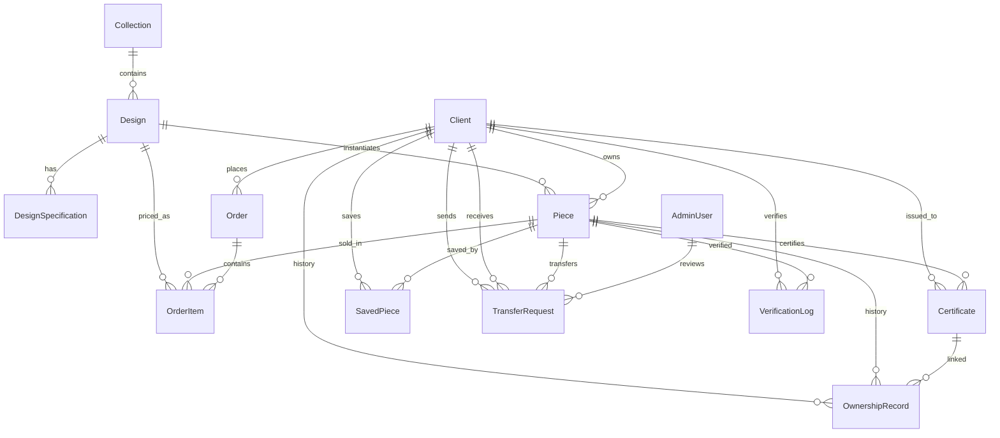

# Database Model Relationships

Schema relationship reference for `@dadan/db`. For column definitions see [prisma/schema.prisma](prisma/schema.prisma). For business rules and lifecycles see [DADAN_BUSINESS_LOGIC.md](../../DADAN_BUSINESS_LOGIC.md) §2. For setup and seed data see [README.md](README.md).

**15 models · 8 enums · PostgreSQL via Prisma 6**

---

## Entity relationship diagram

All foreign-key-backed relations:

### Models without Prisma relations

These tables are not connected via foreign keys in the schema:

| Model | References | Notes |
|-------|------------|-------|
| **CartItem** | `clientId`, `pieceId` (strings) | Indexed only — **no DB FK**. `pieceId` is globally unique (one hold per piece). |
| **AuditLog** | `actorType` + `actorId`, `targetType` + `targetId` | Polymorphic — references any actor/target by convention. |

---

## Relationships by domain

### Catalog

| Parent | Child | FK column | Cardinality | On delete |
|--------|-------|-----------|-------------|-----------|
| Collection | Design | `Design.collectionId` | 1:N | RESTRICT |
| Design | DesignSpecification | `DesignSpecification.designId` | 1:N | CASCADE |
| Design | Piece | `Piece.designId` | 1:N | RESTRICT |
| Design | OrderItem | `OrderItem.designId` | 1:N | RESTRICT |

### Ownership

| Parent | Child | FK column | Cardinality | On delete | Prisma relation |
|--------|-------|-----------|-------------|-----------|-----------------|
| Client | Piece | `Piece.currentOwnerId` | 1:N | SET NULL | `PieceOwner` |
| Client | OwnershipRecord | `OwnershipRecord.clientId` | 1:N | RESTRICT | — |
| Piece | OwnershipRecord | `OwnershipRecord.pieceId` | 1:N | RESTRICT | — |
| Certificate | OwnershipRecord | `OwnershipRecord.certificateId` | 1:N | SET NULL | — |
| Client | Certificate | `Certificate.ownerId` | 1:N | RESTRICT | — |
| Piece | Certificate | `Certificate.pieceId` | 1:N | RESTRICT | — |

### Commerce

| Parent | Child | FK column | Cardinality | On delete |
|--------|-------|-----------|-------------|-----------|
| Client | Order | `Order.clientId` | 1:N | RESTRICT |
| Order | OrderItem | `OrderItem.orderId` | 1:N | CASCADE |
| Piece | OrderItem | `OrderItem.pieceId` | 1:N | RESTRICT |
| Client ↔ Piece | SavedPiece | `clientId`, `pieceId` | M:N | CASCADE (both sides) |

`SavedPiece` uses composite PK `(clientId, pieceId)`.

### Transfers and audit

| Parent | Child | FK column | Cardinality | On delete | Prisma relation |
|--------|-------|-----------|-------------|-----------|-----------------|
| Piece | TransferRequest | `TransferRequest.pieceId` | 1:N | RESTRICT | — |
| Client | TransferRequest | `TransferRequest.fromClientId` | 1:N | RESTRICT | `TransferSender` |
| Client | TransferRequest | `TransferRequest.toClientId` | 1:N | RESTRICT | `TransferRecipient` |
| AdminUser | TransferRequest | `TransferRequest.dadanReviewedBy` | 1:N | SET NULL | — |
| Piece | VerificationLog | `VerificationLog.pieceId` | 1:N | SET NULL | — |
| Client | VerificationLog | `VerificationLog.clientId` | 1:N | SET NULL | — |

---

## Model index

| Model | Role | Direct relations |
|-------|------|------------------|
| **Client** | Invitation-only platform user (House Key auth) | 8 |
| **Collection** | Curated catalog grouping | 1 |
| **Design** | Product template (not a physical piece) | 4 |
| **DesignSpecification** | Key/value spec row for a design | 1 |
| **Piece** | Physical instance with immutable serial number | 7 |
| **OwnershipRecord** | Append-only ownership history event | 3 |
| **Certificate** | Digital authenticity certificate (PDF + QR) | 3 |
| **Order** | Purchase transaction | 2 |
| **OrderItem** | Line item snapshot at purchase time | 3 |
| **SavedPiece** | Client wishlist (M:N join table) | 2 |
| **TransferRequest** | Multi-step ownership transfer workflow | 4 |
| **VerificationLog** | Public serial verification audit trail | 2 |
| **AdminUser** | DADAN staff (email/password auth) | 1 |
| **AuditLog** | Immutable action trail (polymorphic) | 0 |
| **CartItem** | Temporary piece reservation (30-min hold) | 0 |

---

## Enums

| Enum | Values | Used by |
|------|--------|---------|
| `PieceStatus` | `AVAILABLE`, `OWNED`, `TRANSFER_PENDING`, `RETIRED` | `Piece.status` |
| `AcquisitionType` | `PURCHASE`, `GIFT`, `INHERITANCE`, `ADMIN_ASSIGNMENT` | `OwnershipRecord.acquisitionType` |
| `TransferType` | `SALE`, `GIFT`, `INHERITANCE` | `TransferRequest.transferType` |
| `TransferStatus` | `INITIATED`, `SENDER_CONFIRMED`, `RECIPIENT_CONFIRMED`, `DADAN_REVIEW`, `APPROVED`, `REJECTED`, `CANCELLED` | `TransferRequest.status` |
| `OrderStatus` | `PENDING`, `PAID`, `PROCESSING`, `FULFILLED`, `CANCELLED` | `Order.status` |
| `VerificationResult` | `FOUND`, `NOT_FOUND` | `VerificationLog.result` |
| `AdminRole` | `SUPER_ADMIN`, `STAFF`, `VIEWER` | `AdminUser.role` |
| `ActorType` | `CLIENT`, `ADMIN`, `SYSTEM` | `AuditLog.actorType` |

---

## Schema caveats

These rules are enforced in the API service layer, not always by database constraints:

- **OwnershipRecord** — append-only; records are never deleted.
- **TransferRequest** — status transitions are forward-only.
- **CartItem.pieceId** — globally unique; a piece can only be held in one cart at a time (30-minute expiry).
